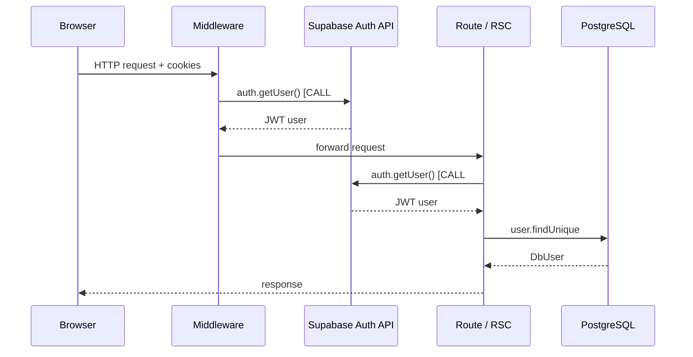

# Authentication Deduplication — Architecture Proposal

**Date:** 2026-06-21  
**Status:** Proposal only (not implemented)  
**Goal:** Establish authenticated user identity **once per HTTP request** and eliminate duplicate Supabase Auth network calls.

---

## 1. Executive summary

BuddyIntro currently calls `supabase.auth.getUser()` **at least twice** on almost every authenticated request:

1. **Middleware** (`lib/supabase/middleware.ts`) — session refresh + route protection  
2. **Route handler or RSC** (`lib/auth.ts` → `getAuthUser()`) — identity for Prisma / business logic  

Measured impact when PostgreSQL is fast (~16ms `SELECT 1`):

| Layer | Typical latency |
|-------|-----------------|
| Single `getUser()` (Supabase Auth network) | **200–800ms** |
| Duplicate call per request | **+200–800ms** |
| `prisma.user.findUnique` (after auth) | **3–40ms** |

**Expected savings from deduplication:** **200–800ms per API call**, **200–800ms per page navigation**, with larger gains when Supabase Auth is slow or distant.

---

## 2. Current authentication flow



### Why `React.cache()` does not fix this

`getCurrentUser` is wrapped in `React.cache()` (`lib/auth.ts:41`), which **only dedupes within a single React Server Components render pass**. It does **not** share state with:

- Next.js **middleware** (Edge runtime, separate invocation)
- **Route Handlers** (`app/api/**/route.ts`) — each handler is a separate Node invocation; `cache()` from `react` does not apply the same way across middleware → API boundary

Within one SSR page, multiple `requireUser()` calls (layout + page) **do** collapse to one `getCurrentUser()` — that part already works.

---

## 3. Inventory: every `supabase.auth.getUser()` call site

### 3.1 Middleware (always runs first on matched paths)

| File | Line | Context |
|------|------|---------|
| `lib/supabase/middleware.ts` | 34–36 | **Every matched request** — session refresh, login redirect, auth-page redirect |

**Matcher** (`middleware.ts`): all paths except `_next/static`, `_next/image`, favicons, `api/public`.

→ **All `/api/*` routes** (except `/api/public/*`) pay middleware auth **before** the handler runs.

### 3.2 Server auth module

| File | Function | Calls |
|------|----------|-------|
| `lib/auth.ts` | `getAuthUser()` | `supabase.auth.getUser()` — **CALL #2 for most requests** |
| `lib/auth.ts` | `getCurrentUser()` | `getAuthUser()` + `prisma.user.findUnique` + optional create/update + `syncLegacyAdminRole` |
| `lib/auth.ts` | `requireUser()` | `getCurrentUser()` + redirect if missing |
| `lib/auth.ts` | `requireAdmin()` | `requireUser()` + RBAC |
| `lib/auth.ts` | `requireAdminApi()` | `getCurrentUser()` + RBAC (+ **duplicate** `syncLegacyAdminRole`) |

### 3.3 Direct `getUser()` in routes (bypass `lib/auth.ts`)

| File | Notes |
|------|-------|
| `app/api/auth/bootstrap/route.ts:17` | Post-signup bootstrap; also hit by middleware |
| `app/auth/callback/route.ts:26` | OAuth/magic-link callback; public path but middleware still runs `getUser()` |

### 3.4 Indirect via `getCurrentUser()` / `requireUser()`

#### API Route Handlers (~45 files)

All import from `@/lib/auth` and trigger **CALL #2**:

| Pattern | Count (approx) | Examples |
|---------|------------------|----------|
| `requireUser()` | ~35 route files | `/api/messages`, `/api/media`, `/api/stories`, … |
| `getCurrentUser()` | 5 route files | `/api/trust/recommendations`, `/api/discoveries`, `/api/introductions`, `/api/profile/insights`, `/api/notifications/preferences` |
| `requireAdminApi()` | ~12 route files | `/api/admin/*` |

#### Server Components (~20 pages + layouts)

| File | Function |
|------|----------|
| `app/(main)/layout.tsx` | `requireUser()` — **every authenticated page** |
| `app/(main)/maindash/layout.tsx` | `requireAdmin()` |
| `app/(main)/admin/layout.tsx` | `requireAdmin()` |
| `app/(main)/home/page.tsx` | `requireUser()` |
| `app/(main)/discoveries/page.tsx` | `requireUser()` |
| … (15+ more pages) | `requireUser()` |

Within a single page render, layout + page share one `getCurrentUser()` via `React.cache()`.

#### Permission helpers

| File | Function |
|------|----------|
| `lib/permissions.ts` | `requirePermission`, `requirePermissionApi`, `requireAnyPermissionApi` — each calls `getCurrentUser()` |

### 3.5 Client-side (out of scope for server dedup)

| File | Notes |
|------|-------|
| `hooks/useUser.ts:15` | Browser `getUser()` — separate concern; keep as-is |

### 3.6 Intentional single-call paths

| File | Notes |
|------|-------|
| `app/api/auth/logout/route.ts` | Uses `createSupabaseServerClient()` for signOut only — no duplicate issue |
| `app/api/public/**` | Excluded from middleware matcher — **no middleware getUser** |

---

## 4. Problem statement

| Issue | Impact |
|-------|--------|
| **Duplicate `getUser()`** | 2× Supabase Auth RTT per request |
| **Middleware on all `/api/*`** | API JSON endpoints pay full auth refresh even when only needing user id |
| **`requireUser()` in API routes** | Redirects to `/login` on 401 — wrong semantics for JSON APIs (some routes already fixed to `getCurrentUser`) |
| **`syncLegacyAdminRole` twice** | Admin API: once in `getCurrentUser`, again in `requireAdminApi` |
| **No cross-layer identity handoff** | Middleware validates user but does not pass identity downstream |

---

## 5. Design goals

1. **Exactly one Supabase Auth network validation** per HTTP request (middleware OR handler, not both).
2. **Preserve security** — do not trust client-supplied identity headers; only middleware-set internal headers.
3. **Minimal churn** — keep `requireUser()`, `getCurrentUser()`, `requireAdminApi()` as the public API; change internals only.
4. **Compatible with Supabase SSR** — session refresh stays in middleware per Supabase recommendations.
5. **Fast path for DB user** — cache `DbUser` in request scope after first Prisma load.

---

## 6. Recommended architecture: “Middleware establishes, handlers consume”

### 6.1 Overview

```
┌─────────────────────────────────────────────────────────────┐
│ MIDDLEWARE (once per request)                                │
│  1. supabase.auth.getUser()     ← ONLY network auth call     │
│  2. Refresh session cookies if needed                        │
│  3. Set internal request headers (stripped from client):     │
│     x-auth-user-id: <uuid>                                   │
│     x-auth-email: <email>                                    │
│     x-auth-verified: 1|0                                     │
│  4. Route guards (redirect login / home)                     │
└──────────────────────────┬──────────────────────────────────┘
                           │
┌──────────────────────────▼──────────────────────────────────┐
│ ROUTE HANDLER / RSC (same request)                           │
│  getAuthUser():                                              │
│    IF x-auth-user-id present → return AuthUser stub (0ms)    │
│    ELSE fallback getUser() (public paths, tests)             │
│  getCurrentUser():                                           │
│    React.cache + optional AsyncLocalStorage                  │
│    → prisma.user.findUnique (once)                           │
└─────────────────────────────────────────────────────────────┘
```

### 6.2 Layer 1 — Middleware as sole `getUser()` caller

**File:** `lib/supabase/middleware.ts`

After successful `getUser()`:

```typescript
// Pseudocode — not implemented
if (user) {
  request.headers.set("x-auth-user-id", user.id);
  request.headers.set("x-auth-email", user.email ?? "");
  request.headers.set("x-auth-verified", user.email_confirmed_at ? "1" : "0");
}
return NextResponse.next({ request: { headers: request.headers } });
```

**Security rules:**

- Strip any incoming `x-auth-*` headers from the **client** before processing (prevent spoofing).
- Only set headers on the **internal** `NextResponse.next({ request })` forward — never echo to browser.
- On unauthenticated requests, **omit** headers (handlers see null user).

### 6.3 Layer 2 — `getAuthUser()` reads headers first

**File:** `lib/auth.ts`

```typescript
// Pseudocode
export async function getAuthUser() {
  const headers = headers(); // next/headers
  const id = headers.get("x-auth-user-id");
  if (id) {
    return { id, email: headers.get("x-auth-email"), ... }; // stub User
  }
  // Fallback: direct getUser (public routes, scripts, tests)
  return (await createSupabaseServerClient().auth.getUser()).data.user;
}
```

**Latency:** **~0ms** when header present vs **200–800ms** network call.

### 6.4 Layer 3 — Request-scoped `DbUser` cache

Keep existing `React.cache()` on `getCurrentUser()` for RSC deduplication.

**Optional enhancement:** `AsyncLocalStorage` in Route Handlers for API-only dedup when multiple services call `getCurrentUser()` in one handler (rare today).

```typescript
// Pseudocode — lib/auth/request-context.ts
const authStorage = new AsyncLocalStorage<{ dbUser?: DbUser }>();
```

Not required for Phase 1 if each API route calls auth once.

### 6.5 Layer 4 — Alternative fast path: `getSession()` in handlers (Supabase option B)

Supabase docs note that after middleware refreshes cookies, **`getSession()` reads the JWT locally** without a network round-trip.

| Method | Network? | Use when |
|--------|----------|----------|
| `getUser()` | **Yes** — validates with Auth server | Middleware only |
| `getSession()` | **No** — parses cookie JWT | Handlers after middleware refresh |
| Header pass-through | **No** | Handlers after middleware `getUser()` |

**Recommendation:** Prefer **header pass-through** over `getSession()` in handlers because middleware already has the validated `User` object — no JWT parsing duplication, no clock/skew edge cases.

Use `getSession()` only as fallback when middleware did not run (e.g. `/api/public` adjacent custom flows).

---

## 7. Matcher optimization (Phase 2)

Reduce middleware work on low-risk paths:

| Path pattern | Proposal |
|--------------|----------|
| `/api/*` (authenticated JSON) | Keep middleware auth **once**; handlers skip `getUser()` via headers |
| `/api/health` | Exclude from matcher — no auth needed |
| Static assets | Already excluded |

**Do not** remove middleware from `/api/*` entirely — session refresh must happen somewhere.

**Optional:** Split middleware into “refresh only” for API vs “refresh + redirect” for pages.

---

## 8. Special cases

### 8.1 `/auth/callback` and `/api/auth/bootstrap`

Currently: middleware `getUser()` + route `getUser()`.

**After change:** Route reads `x-auth-user-id` from middleware; remove route-level `getUser()` or use header stub.

**Exception:** `exchangeCodeForSession(code)` must run **before** first `getUser()` on callback — middleware may run before code exchange. 

**Fix for callback:** Keep callback as **middleware-excluded** path OR run code exchange in route first, then single `getUser()`. Recommended: **exclude `/auth/callback` from middleware matcher**; route owns full auth flow (1× `getUser()` after exchange).

### 8.2 Public routes

`/`, `/login`, `/invite/*`, `/api/public/*` — middleware still calls `getUser()` today for redirect logic. 

**Optimization:** Use `getSession()` in middleware for public routes (local JWT check only) when deciding redirects; reserve `getUser()` for protected routes. **Phase 3** — smaller win.

### 8.3 Admin `syncLegacyAdminRole`

Called in `getCurrentUser()` and again in `requireAdminApi()`. 

**Fix:** Guard with process-lifetime Set (already partially done in `services/rbac.ts`) — ensure single call per request regardless.

### 8.4 API `requireUser()` redirect anti-pattern

~35 API routes use `requireUser()` which **redirects** instead of returning 401 JSON.

**Separate task:** Introduce `requireUserApi()` returning `401` JSON; not part of auth dedup but improves API correctness.

---

## 9. Implementation plan (phased)

### Phase 1 — Header pass-through (highest ROI, ~1 day)

| Step | Task |
|------|------|
| 1.1 | Add `lib/auth/internal-headers.ts` — constants, strip client spoof headers, build AuthUser stub |
| 1.2 | Middleware: set `x-auth-user-id` after `getUser()` |
| 1.3 | `getAuthUser()`: read headers first, fallback to `getUser()` |
| 1.4 | Add `PROFILE_AUTH=1` logging to verify single network call |
| 1.5 | Exclude `/auth/callback` from middleware OR handle code-exchange ordering |

**Files touched:** `lib/supabase/middleware.ts`, `lib/auth.ts`, `middleware.ts` (matcher tweak)

**Risk:** Low — fallback path preserves current behavior.

### Phase 2 — Consolidate API auth helpers (~0.5 day)

| Step | Task |
|------|------|
| 2.1 | Add `requireUserApi()` — 401 JSON, uses `getCurrentUser()` |
| 2.2 | Migrate API routes from `requireUser()` → `requireUserApi()` |
| 2.3 | Remove duplicate `syncLegacyAdminRole` in `requireAdminApi()` |

### Phase 3 — Middleware matcher tuning (~0.5 day)

| Step | Task |
|------|------|
| 3.1 | Exclude `/api/health` from matcher |
| 3.2 | Evaluate `getSession()` for public-route redirect decisions only |
| 3.3 | Document which paths skip middleware auth |

### Phase 4 — Optional DbUser edge cache (~1 day)

| Step | Task |
|------|------|
| 4.1 | Short TTL cache of `DbUser` by id (in-memory, 30–60s) for hot API paths |
| 4.2 | Invalidate on profile update / ban / suspend |

Only needed if `prisma.user.findUnique` becomes measurable — currently 3–40ms.

---

## 10. Expected latency savings

### Per request type (after Phase 1)

| Request type | Before | After | Savings |
|--------------|--------|-------|---------|
| API route (e.g. `/api/trust/recommendations`) | 400–1600ms auth + 38ms DB | 200–800ms auth + 38ms DB | **200–800ms** |
| SSR page (layout + page) | 400–1600ms + 0ms 2nd getUser (cached) + 40ms DB | 200–800ms + 40ms DB | **200–800ms** |
| `/auth/callback` | 2× getUser | 1× getUser | **200–800ms** |

### Aggregate impact (example session)

User navigates: home → discoveries → introductions → profile, each triggering client API calls:

| Scenario | Duplicate auth calls | Wasted time |
|----------|---------------------|-------------|
| **Before** | 4 pages × 2 + 4 API × 2 = **16** getUser calls | **3.2–12.8s** auth-only |
| **After Phase 1** | 8 getUser calls (1 per HTTP request) | **1.6–6.4s** auth-only |
| **Savings** | 8 calls eliminated | **~1.6–6.4s per navigation session** |

When Supabase Auth RTT is ~50ms (ideal): savings **~400ms per request**.  
When RTT is ~400ms (observed under load): savings **~400ms per request**.  
When RTT is ~800ms (worst case): savings **~800ms per request**.

### Combined with fast local Postgres

Example `/api/trust/recommendations`:

```
BEFORE:  middlewareAuth=500ms + auth=500ms + trustCalculation=38ms = ~1038ms
AFTER:   middlewareAuth=500ms + auth=0ms      + trustCalculation=38ms = ~538ms  (−48%)
```

Example `/api/profile/insights`:

```
BEFORE:  500 + 500 + 462 = ~1462ms
AFTER:   500 + 0   + 462 = ~962ms   (−34%)
```

Auth dedup does **not** fix insights query cost — separate optimization needed.

---

## 11. Verification plan

1. Set `PROFILE_API=1` and log auth segment in middleware + `getAuthUser()`.
2. Assert log shows **exactly one** `[auth-network] getUser()` per request.
3. Run `scripts/profile-api-routes.ts` — Prisma timings unchanged.
4. Hit five target APIs via browser — total time should drop by ~200–800ms each.
5. Security test: send forged `x-auth-user-id` header from client — must be ignored.

---

## 12. What we are NOT changing

- Supabase session refresh in middleware (required for cookie rotation)
- `React.cache()` on `getCurrentUser()` for RSC
- Client-side `hooks/useUser.ts` auth
- RLS or JWT verification for Supabase Data API (Prisma uses service role / direct DB)
- Business logic in `getCurrentUser()` (user create, email verify sync, RBAC)

---

## 13. Decision record

| Option | Pros | Cons | Verdict |
|--------|------|------|---------|
| **A. Header pass-through** | Simple, 0ms handler auth, uses validated middleware user | Must strip spoof headers; callback ordering | **Recommended Phase 1** |
| **B. `getSession()` in handlers** | Supabase-native, no custom headers | Still parses JWT; slightly different from middleware user | **Fallback path** |
| **C. AsyncLocalStorage only** | No header trick | Does not cross middleware boundary | **Supplement for handlers** |
| **D. Remove middleware from `/api/*`** | Saves 1 getUser on API | Breaks session refresh; cookies expire | **Reject** |
| **E. JWT decode manually in handlers** | Fast | Error-prone; duplicates Supabase logic | **Reject** |

---

## 14. Summary

BuddyIntro pays **two Supabase Auth network round-trips** on nearly every request because middleware and `getAuthUser()` both call `getUser()`, and middleware cannot share `React.cache()` with route handlers.

**Recommended fix:** Middleware remains the **single** `getUser()` caller; validated identity flows to handlers via **internal request headers**; `getAuthUser()` becomes a **0ms header read**; `getCurrentUser()` continues to load `DbUser` from Postgres once per request.

**Expected savings: 200–800ms per API call and per page load** — the dominant gap between 20ms Postgres and multi-second API responses.

**Next step:** Review and approve Phase 1; then implement header pass-through in `lib/supabase/middleware.ts` and `lib/auth.ts`.
