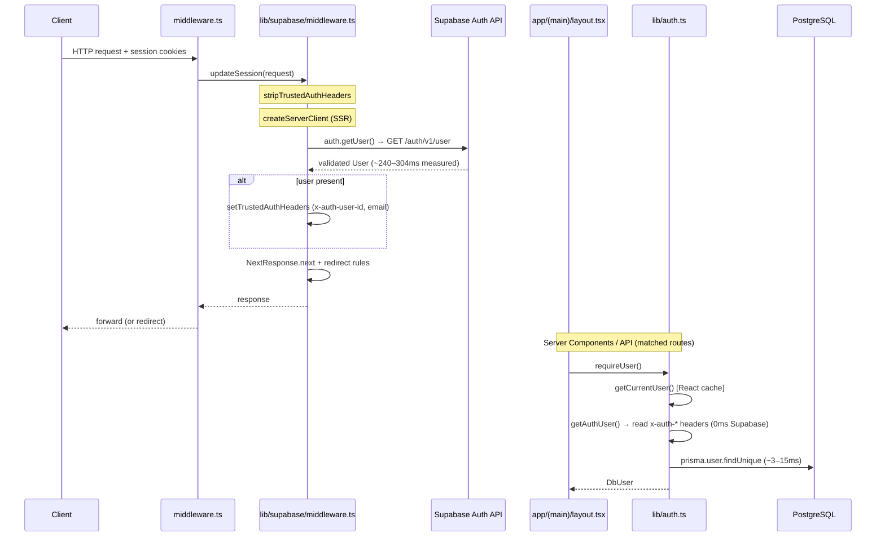
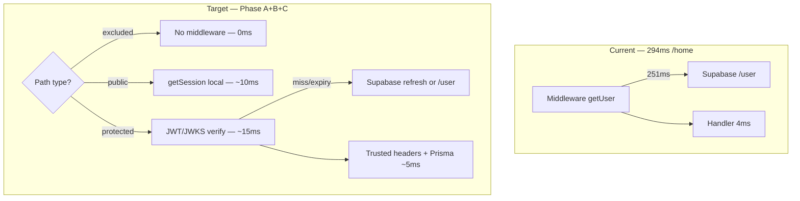

# Auth Latency Reduction Plan

Generated: 2026-06-22  
Scope: **Analysis only** — no code changes  
Context: Application layer optimized; production warm benchmarks show **auth = 239–304ms** dominates TTFB.

## Executive summary

BuddyIntro's remaining latency is almost entirely **middleware `supabase.auth.getUser()`** — one **`GET /auth/v1/user`** to Supabase Auth per matched request (~220–280ms of the measured 240–304ms). Phase 1 eliminated duplicate route-level auth; handlers and Prisma are **4–15ms**.

**Critical insight:** The middleware `isPublic` flag controls **redirects only**. Public pages (`/`, `/login`, `/privacy`, …) **still call `getUser()`** before checking `isPublic`. Matcher narrowing is the only way to skip auth entirely for a path.

| Priority | Option | Est. savings | Complexity | Security risk |
| -------- | ------ | ------------ | ---------- | ------------- |
| **1** | Narrow matcher (`/api/health`, manifest, icons) | **~250ms** per excluded request | Low | Low |
| **2** | Region colocation (Edge ↔ Supabase Auth) | **−130–200ms** on all auth | Infra | None |
| **3** | Public-route fast path (`getSession` for redirects only) | **~240ms** on public hits | Medium | Low–medium |
| **4** | Local JWT / JWKS verification (replace `/user`) | **~200–270ms** on protected hits | Medium–high | Medium (with ban checks) |
| **5** | Edge validated-session cache (TTL) | **~200–250ms** on cache hit | High | Medium–high |

---

## 1. Current auth architecture

### 1.1 End-to-end request path



### 1.2 File responsibilities

| File | Role | Supabase network? |
| ---- | ---- | ----------------- |
| `middleware.ts` | Invokes `updateSession` on matcher hits | Via child |
| `lib/supabase/middleware.ts` | Session refresh pattern; **`getUser()`**; trusted headers; redirects | **Yes — once per match** |
| `lib/auth-context.ts` | Header names; strip/set trusted `x-auth-*` | No |
| `lib/auth-trusted-headers.ts` | `getAuthUserFromTrustedHeaders()` for RSC/API | No |
| `lib/supabase/server.ts` | `createSupabaseServerClient()` for route fallback | Only if headers absent |
| `lib/auth.ts` | `getAuthUser()` → headers first; `getCurrentUser()` → Prisma; `requireUser()` → ban check | **No** on matched routes (Phase 1) |

### 1.3 Phase 1 outcome (already deployed)

| Layer | Before | After |
| ----- | ------ | ----- |
| Middleware `getUser()` | ~260–400ms | ~240–304ms (unchanged) |
| Route `getUser()` | ~300ms | **0ms** (header pass-through) |
| Combined auth (typical API) | ~634ms | **~250ms** |
| `getUserCalls` per request | 2 | **1** |

Further gains **cannot** come from handler deduplication. They must come from **middleware redesign**, **matcher changes**, or **infrastructure**.

---

## 2. Measured auth breakdown (240–304ms)

### 2.1 Production benchmark (warm, `PROFILE_PRODUCTION=1`, port 3000)

Source: `docs/PRODUCTION_BENCHMARK_REPORT.md`, user-provided figures.

| Route | Total | Auth | Auth % of total | Handler (server total) |
| ----- | ----- | ---- | --------------- | ---------------------- |
| `/home` | **294ms** | **251ms** | 85% | 4ms |
| `/discoveries` | **320ms** | **251ms** | 78% | 14ms |
| `/profile` | **343ms** | **299ms** | 87% | 15ms |
| `/api/messages/.../context` | **323ms** | **304ms** | 94% | 13ms |
| `/api/discoveries` | 280ms | 270ms | 96% | 7ms |
| `/api/profile/insights` | 287ms | 270ms | 94% | 9ms |
| `/introductions` | 288ms | 239ms | 83% | 6ms |

**Median warm auth across routes:** ~**267ms**.  
**Application work (Prisma + handler):** ~**4–15ms** on pages; profile SSR data adds wall time but not auth.

### 2.2 What `x-bench-auth-ms` / `x-auth-profile-middleware-ms` measures

Single timer wrapping **`await supabase.auth.getUser()`** only:

```typescript
// lib/supabase/middleware.ts:41-50
const middlewareAuthStart = performance.now();
const { data: { user } } = await supabase.auth.getUser();
const middlewareAuthMs = Math.round(performance.now() - middlewareAuthStart);
```

**Not separately instrumented today:** DNS, TLS, cookie parse, refresh, `createServerClient`, response rebuild.

### 2.3 Inferred segment breakdown (warm authenticated request, auth ≈ 251ms)

Based on `@supabase/auth-js` v2.105.4 source (`GoTrueClient._getUser`, `__loadSession`) and typical Edge→Supabase RTT:

| Segment | Est. ms | % of auth | Evidence |
| ------- | ------- | --------- | -------- |
| **DNS lookup** | 0–5 (warm) | ~0–2% | Edge isolate reuses resolver cache to Supabase host |
| **DNS lookup** | 20–80 (cold) | — | First request to Auth host in isolate |
| **TLS negotiation** | 0–20 (resumed) | ~0–8% | Warm keep-alive / session resumption to same host |
| **TLS negotiation** | 50–150 (cold) | — | New TCP+TLS to `*.supabase.co` |
| **Cookie parsing / session load** | 5–15 | ~3–6% | `request.cookies.get` + base64url decode; up to 5 chunks (`@supabase/ssr`) |
| **`createServerClient`** | 1–3 | ~1% | Sync setup + cookie adapter |
| **Token refresh** (`_callRefreshToken`) | **0** typical | 0% | Only when access token within `EXPIRY_MARGIN` of expiry |
| **Token refresh** (when triggered) | +100–250 | — | Extra network before `/user`; explains auth spikes >350ms |
| **`GET /auth/v1/user`** (inside `getUser`) | **220–240** | **~85–95%** | auth-js always calls Auth API when session exists |
| **`auth.getSession()`** | N/A | — | **Not called** in BuddyIntro middleware today |
| **Response reconstruction** | 1–3 | ~1% | Two `NextResponse.next()` builds; header attach |
| **Redirect logic** | 0 | 0% | Not taken on 200 responses |

**Conclusion:** The 240–304ms band is **`GET /auth/v1/user` network latency** (+ jitter), not cookie parsing or response building. Variance (251ms vs 304ms) aligns with **RTT fluctuation** and occasional **token refresh**.

### 2.4 Why `getSession()` is not in the path

Middleware uses **`getUser()` only**. If it used `getSession()` instead:

- Would skip `/user` (~220–240ms) on valid non-expiring tokens
- Would **not** be safe for protected-route authorization without separate JWT cryptography (Supabase warns cookie session is untrusted on server)

See Section 5 for feasibility analysis.

---

## 3. Routes running middleware auth

### 3.1 Matcher rule (what enters middleware)

```typescript
// middleware.ts
"/((?!_next/static|_next/image|favicon.ico|robots.txt|sitemap.xml|api/public).*)"
```

**Excluded from middleware entirely (zero auth cost):**

| Pattern | Examples |
| ------- | -------- |
| `_next/static/*` | JS/CSS chunks |
| `_next/image/*` | Image optimizer |
| `favicon.ico` | Favicon |
| `robots.txt` | *(file not present in repo; pattern ready)* |
| `sitemap.xml` | *(file not present in repo; pattern ready)* |
| `api/public/*` | `/api/public/invites/[token]` |

**Everything else runs full middleware auth**, including:

### 3.2 Page routes (35 pages — all matched except none beyond exclusions)

| Category | Paths | Middleware `getUser()`? | `isPublic` redirect bypass? |
| -------- | ----- | ----------------------- | --------------------------- |
| **Protected app** | `/home`, `/discoveries`, `/profile`, `/messages`, `/introductions/*`, `/notifications`, `/create-story`, `/stories/*`, `/share`, `/admin`, `/maindash/*` | **Yes** | No — auth required |
| **Auth pages** | `/login`, `/signup` | **Yes** | Yes — allow unauthenticated |
| **Marketing / legal** | `/`, `/privacy`, `/terms`, `/cookies` | **Yes** | Yes — allow unauthenticated |
| **Invite flows** | `/invite/[token]`, `/invite-preview/[token]` | **Yes** | Yes |
| **PWA** | `/offline` | **Yes** | **No** — redirects to `/login` if no session |
| **OAuth** | `/auth/callback` (route handler) | **Yes** | Yes (`/auth/` prefix) |

### 3.3 API routes (62 handlers — 61 matched)

| Category | Count | Middleware auth? | Notes |
| -------- | ----- | ---------------- | ----- |
| **Protected APIs** | ~55 | **Yes** | All `/api/*` except `/api/public/*` |
| **Public API** | 1 | **No** | `/api/public/invites/[token]` |
| **Auth utilities** | 2 | **Yes** | `/api/auth/bootstrap`, `/api/auth/logout` |
| **Health** | 1 | **Yes** ⚠️ | `/api/health` — no auth needed for ops |
| **Analytics** | 2 | **Yes** | `/api/analytics/track`, `/api/analytics/pwa` |
| **Share PWA** | 2 | **Yes** | `/api/share/target` (manifest share_target) |

### 3.4 Generated / metadata routes (matched — pay auth)

| Route | Source | Auth today |
| ----- | ------ | ---------- |
| `/manifest.webmanifest` | `app/manifest.ts` | **Yes** (~250ms wasted for PWA install checks) |
| `/icons/*` (if not under `_next/static`) | `public/icons/` | **Likely yes** |

### 3.5 Routes that run middleware but do NOT need validated identity

These still pay **`getUser()`** today because `isPublic` only skips the **login redirect**, not auth:

| Route | Why auth is wasteful |
| ----- | -------------------- |
| `/`, `/privacy`, `/terms`, `/cookies` | Static/legal content; only need session for optional nav |
| `/login`, `/signup` | Only need to know "already logged in?" for redirect |
| `/invite/*`, `/invite-preview/*` | Token-based public preview |
| `/api/health` | Load balancer / k8s probes |
| `/manifest.webmanifest` | Browser PWA fetch, no user context |
| `/offline` | Static fallback page |
| `/api/analytics/pwa` | May accept anonymous telemetry |

---

## 4. Routes that can safely bypass middleware auth

### 4.1 Tier A — Exclude from matcher (recommended, low risk)

No middleware execution → **~250ms saved per request**.

| Route | Rationale | Risk |
| ----- | --------- | ---- |
| **`/api/health`** | Ops probes; handler runs DB/storage checks without user identity | **None** — already unauthenticated |
| **`/manifest.webmanifest`** | PWA metadata; no secrets | **None** |
| **`/offline`** | Static PWA offline shell | **None** |
| **`/icons/**`** | Static assets (`public/icons/`) | **None** if served as static files |
| **`/api/analytics/pwa`** | If designed for anonymous client metrics | **Low** — verify handler doesn't require session |

**Aggregate impact:** Low unless health/manifest polled frequently. A k8s probe every 10s on `/api/health` wastes **~250ms × 6/min** of Auth API load.

### 4.2 Tier B — Matcher exclude with handler-side auth (medium risk)

| Route | Rationale |
| ----- | --------- |
| `/api/public/**` (already excluded) | Keep as-is |
| Future **`/api/webhooks/*`** | Third-party callbacks |

### 4.3 Tier C — Keep middleware but use fast auth path (not bypass)

| Route | Approach |
| ----- | -------- |
| `/`, `/login`, `/signup`, legal pages | **`getSession()` or cookie-presence** for redirect only — still in middleware but skip `/user` |
| `/auth/callback` | Exclude from middleware OR remove duplicate `getUser()` in handler |

### 4.4 Tier D — Must keep full `getUser()` (protected)

All `(main)` app pages, messages, discoveries, profile, admin, maindash, and authenticated APIs.

**Ban/suspend enforcement:** `requireUser()` checks Prisma `bannedAt` / `suspendedAt` — independent of Supabase `/user`. Local JWT path must still run this check.

---

## 5. Option evaluation

### 5.1 Matcher narrowing

| | |
| --- | --- |
| **Savings** | **~240–304ms** per excluded request (full auth skip) |
| **Complexity** | **Low** — edit `middleware.ts` matcher regex |
| **Security** | **Low risk** if only truly public/ops paths excluded; handlers must not assume middleware ran |
| **Feasibility** | **High** — immediate |

**Caveat:** Excluded routes lose trusted `x-auth-*` headers. Handlers that need optional auth must call `getAuthUser()` fallback (existing path).

---

### 5.2 `auth.getSession()` in middleware (public routes only)

| | |
| --- | --- |
| **Savings** | **~220–240ms** on public-route hits (skip `/user`) |
| **Complexity** | **Medium** — split middleware logic: public vs protected paths |
| **Security** | **Low–medium** — acceptable for redirect decisions ("go to /home if cookie session exists"); **not** for granting access to private data |
| **Feasibility** | **High** for `/login`, `/`, legal pages only |

**Implementation sketch (conceptual):**

```
if (isPublicPath && !needsFullValidation) {
  session = await getSession()  // local + optional refresh
  apply redirect rules from session.user
} else {
  user = await getUser()  // full validation
  setTrustedAuthHeaders(user)
}
```

**Security implication:** A forged cookie could redirect away from `/login` but could not access `/home` without passing protected-path validation on the next navigation — **if** protected paths still use `getUser()` or JWT verify.

---

### 5.3 Local JWT verification

| | |
| --- | --- |
| **Savings** | **~200–270ms** on protected routes (replace `/user` with local verify) |
| **Complexity** | **Medium–high** — JWKS fetch/cache, clock skew, key rotation |
| **Security** | **Medium** — cryptographically sound if asymmetric keys enabled; must retain Prisma ban/suspend checks; revoked sessions may lag until JWT expiry |
| **Feasibility** | **Medium** — Supabase auth-js supports JWKS cache (`GLOBAL_JWKS` in GoTrueClient); verify `getClaims()` availability in installed version |

**When `/user` still required:**

- First login after key rotation (JWKS refresh)
- Token near expiry (refresh flow)
- Sensitive admin operations (optional hard re-validation)

---

### 5.4 JWKS verification

Same as 5.3 — Supabase **asymmetric signing keys** enable offline signature verification without Auth API round trip.

| | |
| --- | --- |
| **Savings** | Same as local JWT (~200–270ms) |
| **Complexity** | **Medium** — enable in Supabase dashboard; cache JWKS at edge (TTL) |
| **Security** | **Good** if JWT signature valid + short expiry + Prisma ban check |
| **Prerequisite** | Confirm project uses asymmetric JWTs (Supabase signing keys migration) |

---

### 5.5 Cached validated sessions (Edge KV / in-memory)

| | |
| --- | --- |
| **Savings** | **~200–250ms** on cache hit |
| **Complexity** | **High** — cache key design, TTL, invalidation on logout/ban/password change |
| **Security** | **Medium–high risk** if invalidation incomplete; stale session if user banned server-side |
| **Feasibility** | **Medium** — needs Edge KV (Vercel) or similar; must not cache across users |

**Recommendation:** Only after local JWT verify; cache JWKS + verified claims, not raw "user id strings" without signature validation.

---

### 5.6 Region colocation (Edge ↔ Supabase Auth)

| | |
| --- | --- |
| **Savings** | **−130–200ms** if currently cross-region (e.g. EU app → US Supabase) |
| **Complexity** | **Infra** — align Vercel/hosting region with Supabase project region |
| **Security** | **None** |
| **Feasibility** | **High** — audit `NEXT_PUBLIC_SUPABASE_URL` region vs deployment |

If RTT is already ~30ms, colocation saves little; **local JWT** becomes higher ROI.

---

### 5.7 Fix double-auth edge paths

| Path | Issue | Savings |
| ---- | ----- | ------- |
| `/auth/callback` | Middleware + route both call `getUser()` | **~250ms** on OAuth callback |
| `/api/auth/bootstrap` | Middleware + route both call `getUser()` | **~250ms** on bootstrap |

**Complexity:** Low — exclude from matcher or remove route-level call.

---

## 6. Recommended implementation order

### Phase A — Quick wins (1–2 days, low risk)

| # | Change | Est. savings | Complexity |
| - | ------ | ------------ | ---------- |
| A1 | **Exclude `/api/health`** from matcher | ~250ms per probe | Low |
| A2 | **Exclude `/manifest.webmanifest`**, `/offline`, `/icons/*`** | ~250ms per PWA/metadata fetch | Low |
| A3 | **Audit Supabase ↔ deployment region** | −130–200ms all routes if misaligned | Infra |
| A4 | **Exclude `/auth/callback`** from matcher (route owns auth) | ~250ms on OAuth | Low |

**Expected impact:** No change to `/home` TTFB yet; reduces wasted Auth load and fixes ops/PWA paths.

---

### Phase B — Public fast path (3–5 days, medium risk)

| # | Change | Est. savings | Complexity |
| - | ------ | ------------ | ---------- |
| B1 | Split middleware: **`getSession()` on `isPublic` paths** for redirect logic only | ~240ms on `/`, `/login`, legal, invite pages | Medium |
| B2 | Keep **`getUser()` on all protected paths** | — | — |
| B3 | Add middleware segment timers (DNS/TLS/session/network) for evidence | Measurement only | Low |

**Expected impact:** Public crawlers and logged-out landing page visits skip `/user`. Authenticated app routes unchanged.

---

### Phase C — Protected path JWT verify (1–2 weeks, medium risk)

| # | Change | Est. savings | Complexity |
| - | ------ | ------------ | ---------- |
| C1 | Enable Supabase **asymmetric JWT signing keys** | Prerequisite | Dashboard |
| C2 | Middleware: **`getClaims()` / JWKS verify** instead of `/user` when token valid | **~200–270ms** on `/home`, `/discoveries`, APIs | Medium–high |
| C3 | Fallback to **`getUser()`** on verify failure, near expiry, or admin routes | Safety net | Medium |
| C4 | Retain **`requireUser()` Prisma ban/suspend** check | Security | Already exists |

**Expected impact:** `/home` auth **251ms → ~20–50ms** (local verify + cookies). Total **294ms → ~80–120ms** (estimated).

---

### Phase D — Optional advanced (evaluate after C)

| # | Change | Est. savings | Complexity |
| - | ------ | ------------ | ---------- |
| D1 | Edge JWKS cache with TTL | −5–20ms on JWKS fetch amortization | Medium |
| D2 | Short-lived validated-claims cache (per session id) | ~200ms on repeat hits within TTL | High |
| D3 | Narrow matcher for **`/api/analytics/track`** if anonymous | Per-request | Low–medium |

---

## 7. Target state architecture



---

## 8. Security checklist (must hold for any phase)

| Requirement | Phase A | Phase B | Phase C |
| ----------- | ------- | ------- | ------- |
| Client cannot spoof `x-auth-*` headers | ✓ strip | ✓ strip | ✓ strip |
| Protected data requires validated identity | ✓ getUser | ✓ getUser on protected | ✓ JWT verify |
| Banned/suspended users blocked | ✓ Prisma | ✓ Prisma | ✓ Prisma |
| Session refresh before expiry | ✓ getUser path | ✓ getSession refresh | ✓ fallback getUser |
| Logout invalidates access | ✓ | ✓ | ⚠️ JWT TTL window |
| Admin routes strongly authenticated | ✓ | ✓ | ✓ recommend getUser fallback |

---

## 9. Instrumentation gaps (recommended before Phase C)

Add middleware sub-timers (future work):

| Timer | Purpose |
| ----- | ------- |
| `createClientMs` | SSR client setup |
| `loadSessionMs` | Cookie parse + decode |
| `refreshMs` | Token refresh network |
| `getUserNetworkMs` | `/user` HTTP only |
| `responseBuildMs` | NextResponse reconstruction |

External measurement:

```bash
# RTT to Supabase Auth (from deployment region)
curl -w "dns:%{time_namelookup} connect:%{time_connect} tls:%{time_appconnect} ttfb:%{time_starttransfer}\n" \
  -o /dev/null -s "$SUPABASE_URL/auth/v1/health"
```

---

## 10. Summary

| Question | Answer |
| -------- | ------ |
| Why 240–304ms? | **`GET /auth/v1/user`** on every matched request (~85–95% of auth ms) |
| Is duplicate auth the cause? | **No** — Phase 1 fixed that; route auth is 0ms |
| Does `getSession()` help protected routes? | **Not safely** without JWT cryptography |
| Fastest low-risk win? | **Matcher exclusions** for health, manifest, offline |
| Largest win for `/home`? | **Local JWT/JWKS verify** in middleware (Phase C) + region audit |
| Expected `/home` after Phase C | **~80–120ms total** (auth ~15–40ms + handler ~5ms + overhead) |

---

*Analysis only. No code modified. Related: `docs/SUPABASE_AUTH_DEEP_DIVE.md`, `docs/AUTH_PHASE1_IMPLEMENTATION.md`, `docs/PRODUCTION_BENCHMARK_REPORT.md`.*
