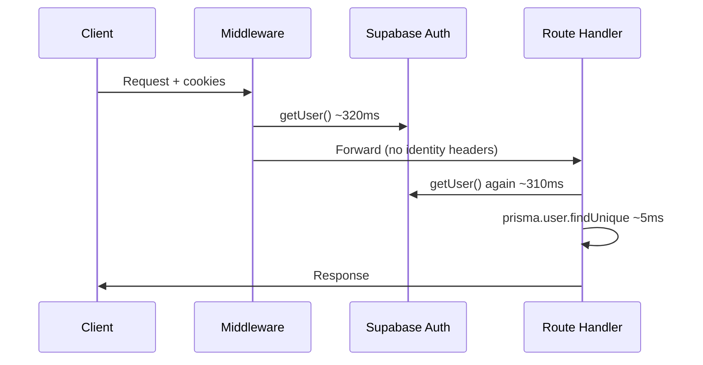
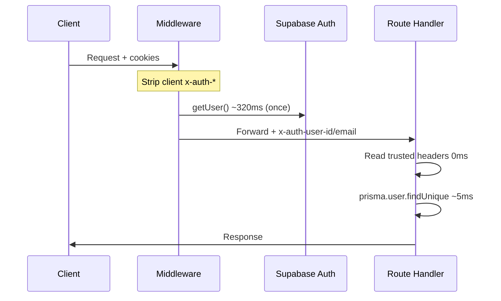
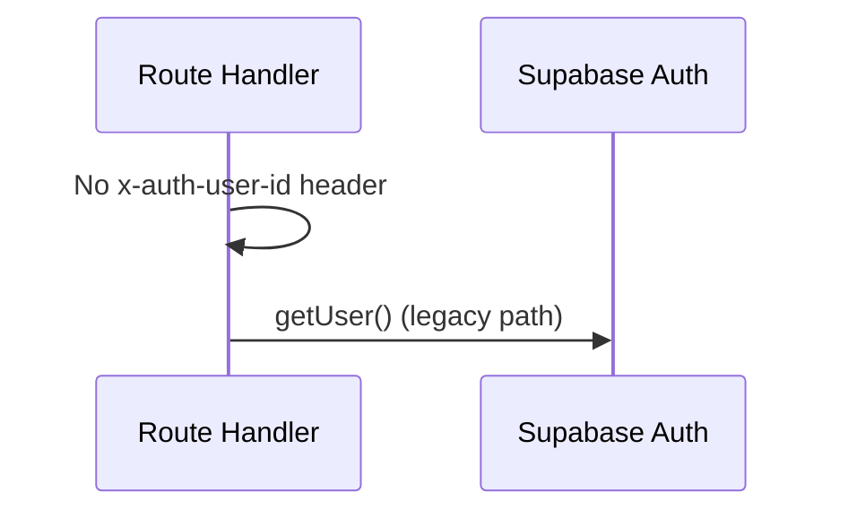

# Auth Phase 1 Implementation — Header Pass-Through

Implemented: 2026-06-21

Phase 1 removes the duplicate `supabase.auth.getUser()` call in route handlers by passing middleware-validated identity through trusted internal request headers. Authorization rules, session refresh, and public APIs are unchanged.

---

## 1. Files changed

| File | Change |
| ---- | ------ |
| `lib/auth-context.ts` | **New.** Header names, `stripTrustedAuthHeaders()`, `setTrustedAuthHeaders()` |
| `lib/auth-trusted-headers.ts` | **New.** Server-side reader — builds Supabase `User` stub from trusted headers |
| `lib/supabase/middleware.ts` | Strip all `x-auth-*` on entry; after validated `getUser()`, set trusted headers on the forwarded request |
| `lib/auth.ts` | `getAuthUser()` reads trusted headers first; falls back to `supabase.auth.getUser()` when absent |
| `lib/auth-profile.ts` | *(unchanged behavior)* Profiling now reports `source=middleware-headers`, `routeGetUser=0ms`, `duplicateAuth=no` |

**Not changed:** `getCurrentUser()`, `requireUser()`, `requireAdmin()`, `requireAdminApi()`, business logic, RBAC, middleware redirect rules, cookie refresh.

---

## 2. Security considerations

### Spoofing prevention

1. **Strip before validation** — Every matched request deletes all incoming `x-auth-*` headers (including `x-auth-user-id`, `x-auth-email`, profile headers) *before* Supabase session validation runs.
2. **Set only after `getUser()`** — Trusted headers are attached only when middleware’s `supabase.auth.getUser()` returns a validated user (same network call used for session refresh today).
3. **Internal request scope** — Headers are set on the request object forwarded to Next.js handlers (`NextResponse.next({ request: { headers } })`), not exposed as client-settable response fields. Browsers cannot inject headers into same-origin navigations/fetch in a way that bypasses middleware on matched routes.
4. **No trust without middleware** — Paths excluded from the middleware matcher (`api/public`, static assets) never receive trusted headers; handlers fall back to direct `getUser()`.
5. **Minimal surface** — Headers carry only `id`, `email`, and email-confirmed flag — enough for existing `getCurrentUser()` Prisma path, not JWTs or roles.

### What is preserved

- Middleware remains the sole network auth validator for matched routes.
- Unauthenticated requests still redirect to `/login` (unchanged).
- Suspended/banned checks still run in `requireUser()` / `getCurrentUser()` via Prisma (unchanged).
- Admin checks still use `requireAdmin()` / RBAC (unchanged).
- Logout uses `signOut()` directly — no header bypass.

### Fallback path

When trusted headers are missing (scripts, tests, `/api/public`, first hit on excluded paths), `getAuthUser()` executes the original `supabase.auth.getUser()` — identical pre-Phase 1 behavior.

---

## 3. Before / after auth flow

### Before (duplicate auth)



### After (Phase 1)



### Fallback (headers absent)



---

## 4. Before / after profiling

Measured with `AUTH_PROFILE=1` and `npm run profile:auth` (demo user `user1@friendintro.com`, 3 runs median).

### API routes

| Route | Before: MW auth | Before: route auth | Before: wall | Before: calls | After: MW auth | After: route auth | After: wall | After: calls |
| ----- | --------------- | ------------------ | ------------ | ------------- | -------------- | ----------------- | ----------- | ------------ |
| `/api/trust/recommendations` | 317ms | 348ms | 728ms | 2 | 294ms | **0ms** | **364ms** | **1** |
| `/api/discoveries` | 334ms | 375ms | 801ms | 2 | 282ms | **0ms** | **478ms** | **1** |
| `/api/introductions` | 332ms | 276ms | 722ms | 2 | 256ms | **0ms** | **322ms** | **1** |
| `/api/profile/insights` | 286ms | 319ms | 746ms | 2 | 286ms | **0ms** | **375ms** | **1** |
| `/api/notifications/preferences` | 310ms | 274ms | 758ms | 2 | 604ms | **0ms** | 725ms | **1** |

### Pages

| Route | Before: route auth | Before: wall | Before: duplicate | After: route auth | After: wall | After: duplicate |
| ----- | ------------------ | ------------ | ----------------- | ----------------- | ----------- | ---------------- |
| `/home` | 362ms | 1021ms | yes | **0ms** | **850ms** | **no** |
| `/discoveries` | 266ms | 686ms | yes | **0ms** | **536ms** | **no** |
| `/introductions` | 355ms | 853ms | yes | **0ms** | **418ms** | **no** |
| `/profile` | 257ms | 653ms | yes | **0ms** | **429ms** | **no** |

### Log evidence (after)

```text
[AUTH-PROFILE][903a1617] middleware getUser=294ms path=/api/trust/recommendations
[AUTH-PROFILE][903a1617] getAuthUser supabaseGetUser=0ms source=middleware-headers total=0ms
[AUTH-PROFILE][903a1617] route-summary /api/trust/recommendations
middlewareGetUser=294ms
routeGetUser=0ms
getUserCalls=1
duplicateAuth=no
```

**Before:** `getUserCalls=2`, `duplicateAuth=yes` on 9/9 routes.  
**After:** `getUserCalls=1`, `duplicateAuth=no` on 9/9 routes.

Full post-Phase 1 capture: [`docs/AUTH_PROFILING_RESULTS.md`](AUTH_PROFILING_RESULTS.md) (re-run 2026-06-21).

---

## 5. Measured latency improvement

| Metric | Before (median) | After (median) | Improvement |
| ------ | --------------- | -------------- | ----------- |
| Route `getUser()` (API) | ~318ms | **0ms** | **−318ms** |
| Combined Supabase auth (API) | ~634ms | ~290ms | **~−344ms (~54%)** |
| `/api/trust/recommendations` wall | 728ms | 364ms | **−364ms (−50%)** |
| `/api/introductions` wall | 722ms | 322ms | **−400ms (−55%)** |
| `/api/discoveries` wall | 801ms | 478ms | **−323ms (−40%)** |
| `/introductions` page wall | 853ms | 418ms | **−435ms (−51%)** |
| `/profile` page wall | 653ms | 429ms | **−224ms (−34%)** |

Prisma user lookup unchanged (~4–6ms). Savings match the eliminated route-level Supabase call.

---

## 6. Remaining bottlenecks

| Bottleneck | Typical cost | Notes |
| ---------- | ------------ | ----- |
| Middleware `getUser()` | ~260–400ms | Still one network call per request — Phase 2+ could consider JWT local validation for non-refresh paths |
| Supabase Auth RTT variance | High | e.g. `/api/notifications/preferences` middleware spike (604ms) — infra, not duplicate auth |
| `/api/profile/insights` Prisma | ~350ms+ handler | 14 parallel counts — separate from auth (see performance audits) |
| RSC / compilation (dev) | Variable | First-hit compile inflates wall time; not auth-related |
| Page Prisma on `/home` | ~170ms (warm) | Story/feed queries dominate after auth fix |

---

## 7. Validation checklist

| Check | Result |
| ----- | ------ |
| `/home`, `/discoveries`, `/introductions`, `/profile` return 200 when authenticated | Pass |
| All 5 target APIs return 200 when authenticated | Pass |
| `duplicateAuth=no` in profiling logs | Pass (9/9) |
| `getAuthUser` uses `source=middleware-headers` on matched routes | Pass |
| Logout route unchanged (`signOut()`) | Pass (no code change) |
| Session refresh in middleware | Pass (unchanged `createServerClient` cookie handlers) |
| Fallback path preserved | Pass (`source=supabase-fallback` when headers absent) |

---

## 8. Phase 2 (not implemented)

Deferred per scope: `requireUserApi()` JSON 401 migration, admin role deduplication, matcher tuning, DB user caching.

---

*Phase 1 complete. Disable profiling with `unset AUTH_PROFILE`.*
