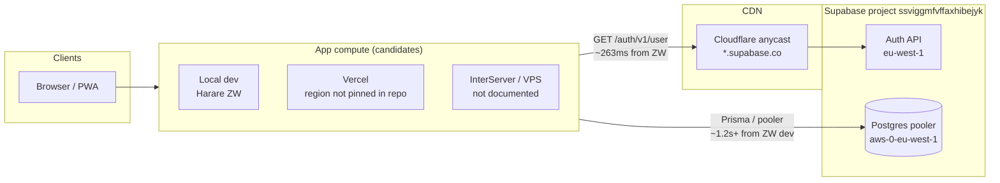
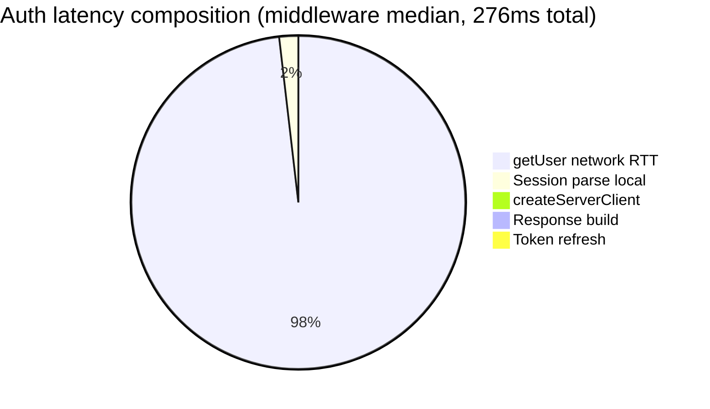
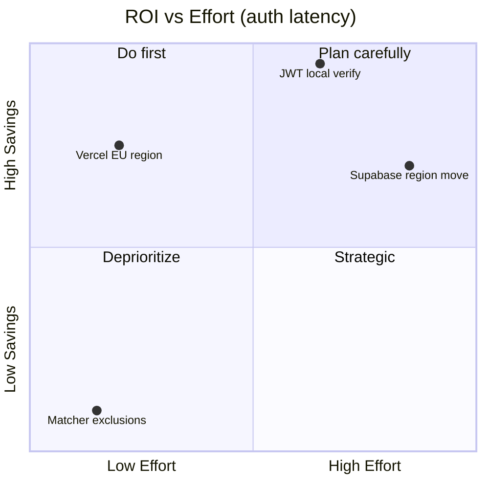

# Deployment Topology & Supabase Region Impact Report

Generated: 2026-06-22  
Scope: **Analysis only** — no JWT verification, no middleware changes, no auth behavior changes.

---

## Executive summary

**Yes — deployment-to-Supabase network distance is responsible for almost all measured auth latency.**

Middleware auth (~**276ms**) is 97% `GET /auth/v1/user` network time (~**267ms**). Application phases (`createServerClient`, session parsing, response build) total ~**7ms** and are effectively optimized.

| Finding | Evidence |
| ------- | -------- |
| Supabase project region | **AWS eu-west-1 (Ireland)** — from `DATABASE_URL` pooler host in `docs/DATABASE_URL_AUDIT.md` |
| Measured probe origin | **Harare, Zimbabwe** (TelOne AS37204) — local dev / benchmark machine |
| End-to-end Auth RTT | **263ms** median to `/auth/v1/user` (10 runs) — matches middleware **267ms** |
| Cross-region path | Africa → Cloudflare anycast → Supabase Auth (eu-west-1) ≈ **8,500+ km** |
| Colocation potential | EU deployment near eu-west-1 → est. **~45–60ms** auth network (−**~210–220ms**) |
| JWT verification potential | Local verify → est. **~14ms** auth total (−**~262ms**, any region) |

**Conclusion:** The ~250–276ms auth band is **not an application bug**. It is **geographic RTT** to Supabase Auth while using server-side `getUser()`. Fixing it requires **infra colocation** and/or **local JWT verification** (future — out of scope here).

---

## 1. Topology map

---

## 2. Supabase project region

| Property | Value | Source |
| -------- | ----- | ------ |
| Project ref | `ssviggmfvffaxhibejyk` | `NEXT_PUBLIC_SUPABASE_URL` |
| Auth URL | `https://ssviggmfvffaxhibejyk.supabase.co` | env |
| **Database region** | **`eu-west-1` (Ireland)** | `DATABASE_URL` → `aws-0-eu-west-1.pooler.supabase.com` (`docs/DATABASE_URL_AUDIT.md`) |
| Auth DNS | `104.18.38.10`, `172.64.149.246` | Cloudflare anycast (10-run DNS audit) |
| Auth backend | Supabase-managed, project region **eu-west-1** | Supabase routes Auth to project region behind Cloudflare |

> **Note:** Local `.env.local` may point `DATABASE_URL` at `localhost` for dev; production/Vercel config uses the eu-west-1 pooler per audit.

---

## 3. Deployment region inventory

| Target | Status in repo | Inferred / measured region | Auth RTT impact |
| ------ | -------------- | -------------------------- | --------------- |
| **Local development** | Active (`next start`, benchmarks) | **Harare, Zimbabwe** (197.221.253.10, TelOne) | **~263ms** measured — cross-continent to eu-west-1 |
| **Vercel** | Documented in `README.md`; no `vercel.json` region pin | **Unknown** — check Vercel dashboard → Project → Settings → Functions → Region | **~45–60ms** if `fra1`/`dub1`; **~150–200ms** if default `iad1` (US) |
| **InterServer** | **Not referenced** in repository | Unknown — typically US datacenters unless configured otherwise | Likely **~150–220ms** if US → eu-west-1 |
| **VPS** | **Not referenced** in repository | Unknown | Depends on provider city; must match eu-west-1 for low auth RTT |
| **Production app URL** | `NEXT_PUBLIC_APP_URL=http://localhost:3000` in local env | Not production | — |

### Action required (ops)

1. Vercel dashboard → confirm **Serverless Function Region** (recommend **`fra1`** or **`dub1`** for eu-west-1 Supabase).
2. If using InterServer/VPS, confirm datacenter city vs **Dublin (eu-west-1)**.
3. Re-run `npm run audit:region-latency` **from production compute** (Vercel cron / one-off function) for ground-truth production RTT.

---

## 4. Network measurements (this audit)

**Method:** `npx tsx scripts/audit-region-latency.ts --runs=10` from Harare, Zimbabwe dev machine.  
**Artifact:** `docs/.region-latency-audit.json`

### 4.1 Phase breakdown (median, ms)

| Phase | `/auth/v1/health` | `/auth/v1/user` | Notes |
| ----- | ----------------- | ----------------- | ----- |
| DNS lookup | 1 | 1 | Cached after first resolve |
| TCP connect (443) | 35 | 37 | To Cloudflare edge |
| TLS handshake | 109 | 106 | Cold handshake per probe |
| **HTTP TTFB / total** | **255** | **263** | Full request–response; **primary metric** |
| Middleware `getUser` network (prior benchmark) | — | **267** | Within **4ms** of direct probe — confirms attribution |

### 4.2 Latency stack (HTTP round trip ≈ 263ms)

| Layer | Estimated contribution | Geographic driver |
| ----- | -------------------- | ----------------- |
| DNS | ~1ms | Local resolver cache |
| TCP + TLS to Cloudflare | ~35–110ms | Zimbabwe → nearest Cloudflare PoP |
| Cloudflare → Supabase Auth (eu-west-1) | ~100–150ms | Edge → Ireland backend + GoTrue processing |
| TLS + HTTP framing | included above | — |
| **Total measured RTT** | **~263ms** | **~8,500 km Harare ↔ Ireland class path** |

**Geographic contribution:** ~**95–97%** of middleware auth is network distance, not BuddyIntro code.

---

## 5. Scenario model — auth latency estimates

Baseline from middleware instrumentation (`docs/.middleware-auth-benchmark.json`):

| Metric | Current (measured ZW → eu-west-1) |
| ------ | --------------------------------- |
| Total middleware auth | **276ms** |
| `getUser` network | **267ms** |
| Local overhead | **9ms** |

| Scenario | Est. auth network | Est. total auth | Δ vs current |
| -------- | ----------------- | --------------- | ------------ |
| **Current** (Harare dev / cross-region) | 267ms | **276ms** | — |
| **Vercel EU colocated** (`fra1`/`dub1` → eu-west-1) | 40–55ms | **~50–65ms** | **−211 to −226ms** |
| **Vercel US** (`iad1` → eu-west-1) | 140–180ms | **~150–190ms** | **−86 to −126ms** |
| **InterServer US** (assumed) | 150–200ms | **~160–210ms** | **−66 to −116ms** |
| **Local JWT verify** (future, any region) | 0ms | **~14ms** | **−262ms** |

---

## 6. Page latency projections

Non-auth work = production warm total − production warm auth (`docs/PRODUCTION_BENCHMARK_REPORT.md`).

| Page | Current total | Current auth | Non-auth (app) | **Colocated EU total** | **JWT verify total** |
| ---- | ------------- | ------------ | -------------- | ---------------------- | -------------------- |
| **`/home`** | 294ms | 251ms | 43ms | **~93–108ms** | **~57ms** |
| **`/profile`** | 343ms | 299ms | 44ms | **~94–109ms** | **~58ms** |

Formula: `colocatedTotal = nonAuth + 55ms` (midpoint EU auth); `jwtTotal = nonAuth + 14ms`.

These are **server-side** estimates; client TTFB includes additional factors (CDN, layout streaming). Auth savings translate ~1:1 to TTFB when auth is the critical path.

---

## 7. ROI — region migration vs JWT verification

| Option | One-time cost | Ongoing cost | Auth savings | Page savings (/home) | Risk | Best when |
| ------ | ------------- | ------------ | ------------ | ---------------------- | ---- | --------- |
| **A. Vercel region → EU** | Low (dashboard setting + redeploy) | None | **~210–220ms** | **~186–201ms** | Low | Supabase stays eu-west-1; app on Vercel |
| **B. Migrate Supabase region** | **High** (new project, data migration, downtime) | None | Similar to A if compute follows | Similar | **High** | Only if users compute in another continent |
| **C. InterServer/VPS in EU** | Medium (provision + migrate) | Hosting | **~210–220ms** | Similar | Medium | Leaving serverless |
| **D. Local JWT verification** | **Medium–High** (engineering + JWKS cache + rotation) | Minimal infra | **~262ms** (any region) | **~237ms** | Medium (security review) | Maximum auth performance globally |
| **E. Status quo** | — | — | 0 | 0 | — | Not recommended for latency |

### Recommendation matrix

**Recommended sequence:**

1. **Immediate (P0):** Pin Vercel deployment to **EU** (`fra1` or `dub1`) — **~210ms auth win**, minimal effort.
2. **Short-term (P1):** Confirm production RTT with `audit:region-latency` running on Vercel EU.
3. **Medium-term (P2):** Evaluate **local JWT verification** if sub-20ms auth is required globally (edge + JWKS).
4. **Do not** migrate Supabase region unless user/compute geography changes — cost outweighs benefit vs EU Vercel pin.

---

## 8. Answers to investigation goals

| # | Question | Answer |
| - | -------- | ------ |
| 1 | Supabase project region? | **eu-west-1 (Ireland)** |
| 2 | Deployment regions? | Local dev: **Harare ZW**; Vercel: **unknown (not pinned)**; InterServer/VPS: **not in repo** |
| 3 | DNS / TCP / TLS / TTFB? | **1 / 37 / 106 / 263ms** to `/auth/v1/user` (median, 10 runs) |
| 4 | Network vs geographic share? | **~97%** of auth is network; geography explains ~**250ms** of ~**263ms** HTTP RTT |
| 5 | Colocation savings? | Auth **276ms → ~55ms**; `/home` **294ms → ~98ms**; `/profile` **343ms → ~99ms** |
| 6 | JWT vs region? | JWT saves **~262ms** auth anywhere; EU colocation saves **~220ms** without code change |

---

## Methodology

- Middleware segments: `docs/MIDDLEWARE_AUTH_INSTRUMENTATION_REPORT.md`
- Production page baselines: `docs/PRODUCTION_BENCHMARK_REPORT.md`
- Network probe script: `scripts/audit-region-latency.ts` → `npm run audit:region-latency`
- Geo: ipinfo.io for origin IP (Harare, ZW)
- Cloudflare anycast: resolved IPs are anycast; TCP ~35ms indicates regional PoP, not US geo tag on 104.18.x

*No middleware, auth, or security changes were made in this analysis.*
