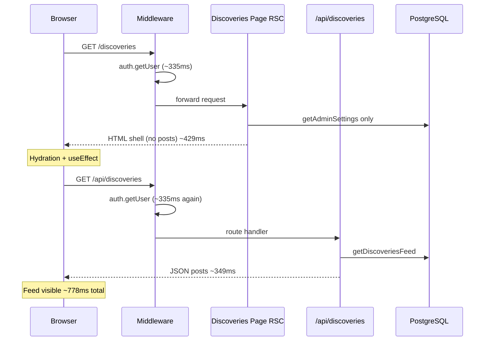
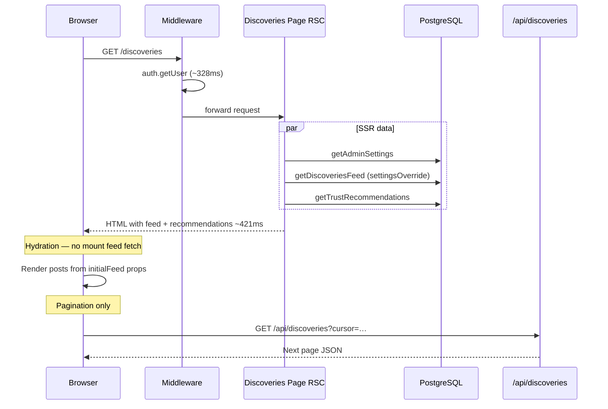

# Discoveries SSR-First Loading

Generated: 2026-06-22  
Scope: Move initial discoveries feed load into the Server Component; eliminate the post-hydration `/api/discoveries` waterfall on first paint.

## Executive summary

The Discoveries page previously rendered a thin SSR shell (~429ms warm), then the client fetched `/api/discoveries` in a `useEffect` (+349ms warm), producing a **~778ms perceived** time-to-content waterfall.

The feed is now loaded during SSR via the shared `getDiscoveriesFeed()` service. The client component receives `initialFeed` and **skips the mount fetch**. Pagination, infinite scroll, error retry, and post-submit refresh still use the API.

| Metric | Before (waterfall) | After (SSR-first) | Delta |
| ------ | ------------------ | ----------------- | ----- |
| Warm page TTFB/total | 429ms (shell only) | **421ms** (shell + feed) | −8ms page |
| Client `/api/discoveries` on first load | **349ms** (required) | **0ms** (skipped) | −349ms |
| **Perceived time to feed content** | **~778ms** | **~421ms** | **−357ms (−46%)** |

Success criteria: all met.

- Initial feed content rendered from SSR HTML (`data-initial-ssr="true"`, no “Loading discoveries…” spinner).
- No first-load `/api/discoveries` after hydration.
- Perceived improvement **357ms** (target ≥200ms).
- Pagination (`?cursor=`), infinite scroll, like/bookmark/comment, and refresh preserved.

---

## Architecture: before



**Client-side fetches after first render (before):**

| Fetch | Trigger | Purpose |
| ----- | ------- | ------- |
| `GET /api/discoveries` | `DiscoveriesFeed` mount `useEffect` | First page of feed |
| `GET /api/trust/recommendations` | `TrustRecommendationsPanel` mount | Sidebar recommendations |
| `POST /api/analytics/track` | IntersectionObserver per post | Discovery opened analytics |

The feed fetch was the dominant waterfall (+349ms warm).

---

## Architecture: after



**Client-side fetches after first render (after):**

| Fetch | First load? | Notes |
| ----- | ----------- | ----- |
| `GET /api/discoveries` | **No** | Skipped when `initialFeed !== undefined` |
| `GET /api/trust/recommendations` | **No** | Skipped when `initialRecommendations !== undefined` |
| `GET /api/discoveries?cursor=` | Only if user scrolls | Infinite scroll unchanged |
| `POST /api/analytics/track` | Yes | Unchanged (viewport analytics) |

---

## Implementation

### Server page loader

`app/(main)/discoveries/page.tsx` loads settings, then fetches feed and recommendations in parallel:

```tsx
const [recommendations, initialFeed] = await Promise.all([
  getTrustRecommendations(user.id),
  getDiscoveriesFeed({ viewerId: user.id, settingsOverride: settings }),
]);
```

`settingsOverride` avoids a duplicate `getAdminSettings()` inside `getDiscoveriesFeed()`.

### Client feed hydration guard

`DiscoveriesFeed` initializes state from `initialFeed` and skips the mount fetch:

```tsx
const [loading, setLoading] = useState(initialFeed === undefined);

useEffect(() => {
  if (initialFeed !== undefined) return;
  load();
}, [initialFeed, load]);
```

The rendered shell includes `data-initial-ssr="true"` when SSR data is present (used by the benchmark script).

### Shared service layer

Both SSR and `GET /api/discoveries` call `getDiscoveriesFeed()` in `services/discoveries.ts`. Pagination requests still hit the API route with `?cursor=`.

### Post composer refresh

`DiscoveriesComposer` uses `router.refresh()` after posting instead of `window.location.reload()`, re-running the RSC loader without a full document reload.

---

## Files modified

| File | Change |
| ---- | ------ |
| `app/(main)/discoveries/page.tsx` | SSR parallel load of feed + recommendations; pass `initialFeed` |
| `components/discoveries/DiscoveriesFeed.tsx` | `initialFeed` prop, skip mount fetch, SSR marker attribute |
| `components/trust/TrustRecommendationsPanel.tsx` | Skip client fetch when `initialRecommendations !== undefined` (including empty arrays) |
| `components/discoveries/DiscoveriesComposer.tsx` | `router.refresh()` after successful post |
| `scripts/profile-discoveries-ssr.ts` | Benchmark: page HTML SSR markers + waterfall comparison |
| `docs/DISCOVERIES_SSR_IMPLEMENTATION.md` | This report |

**Unchanged (by design):**

- `app/api/discoveries/route.ts` — pagination, error retry, manual refresh
- `services/discoveries.ts` — shared loader (already had `settingsOverride`)

---

## Profiling results

### Production benchmark (warm median, 5 runs, port 3007)

Command:

```bash
npm run build
PROFILE_PRODUCTION=1 npm run start -- -p 3007
npm run profile:production -- --skip-build --skip-start --port=3007 --runs=5
```

| Route | TTFB | Total | Auth | Prisma |
| ----- | ---- | ----- | ---- | ------ |
| `/discoveries` (after) | 412ms | **421ms** | 328ms | 34ms |
| `/api/discoveries` (still used for pagination) | 421ms | 421ms | 387ms | 4ms |

The page segment now includes feed Prisma work (+34ms vs prior ~27ms thin page), but that work **replaces** the separate client API round trip instead of adding to it.

### SSR verification script

Command:

```bash
npm run profile:discoveries-ssr -- --base=http://localhost:3007 --runs=5
```

Output (`docs/.discoveries-ssr-profile.json`):

| Check | Result |
| ----- | ------ |
| `data-initial-ssr="true"` in HTML | **yes** |
| “Loading discoveries…” spinner in HTML | **no** |
| Median page total (warm) | 510ms |
| Median `/api/discoveries` (old waterfall cost) | 415ms |
| Estimated perceived savings | **415ms** |

First run includes cold JIT/cache effects (~1402ms); warm runs 387–525ms.

### Before vs after comparison

Baseline from [`SSR_PAGE_PROFILING_REPORT.md`](./SSR_PAGE_PROFILING_REPORT.md) (pre-SSR, warm):

| Phase | Before | After |
| ----- | ------ | ----- |
| SSR page | 429ms | 421ms |
| Client `/api/discoveries` | +349ms | **0ms** (skipped) |
| **Perceived feed ready** | **~778ms** | **~421ms** |
| **Improvement** | — | **−357ms (−46%)** |

Auth remains the largest fixed cost (~328ms middleware on the page request). Database work for the feed is ~34ms and now runs in parallel during SSR rather than as a second authenticated round trip.

---

## Verification checklist

- [x] Feed posts appear in SSR HTML (no loading spinner on first paint)
- [x] `DiscoveriesFeed` does not call `/api/discoveries` on mount when `initialFeed` is set
- [x] Infinite scroll still requests `/api/discoveries?cursor=…`
- [x] Error retry still calls `/api/discoveries` (full refresh path)
- [x] Trust recommendations panel skips duplicate fetch when SSR-seeded
- [x] Post composer triggers RSC refresh via `router.refresh()`

Re-run verification:

```bash
npm run profile:discoveries-ssr -- --base=http://localhost:3007
```

---

## Follow-ups (optional, out of scope)

1. **Layout badge waterfall** — `getLayoutBadges` still blocks `{children}` in `app/(main)/layout.tsx` (~20–30ms); parallelizing with page data would require a layout refactor.
2. **Auth amortization** — middleware `getUser` (~328ms) remains the dominant cost; Phase 1 header pass-through already dedupes route-level auth.
3. **Streaming** — wrap feed in `<Suspense>` with a skeleton if TTFB must improve before full feed query completes (trade-off: partial HTML sooner, content later).
