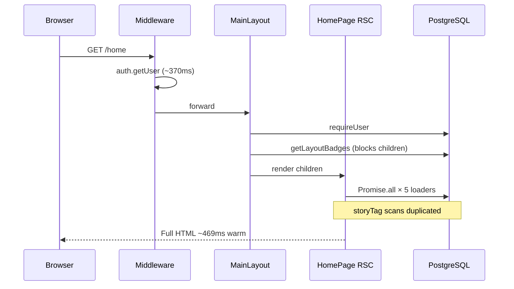
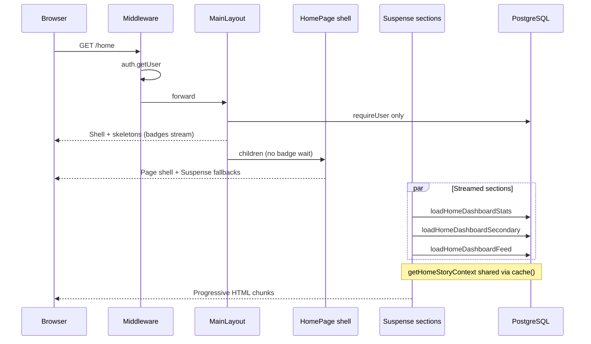

# Home Page — Dashboard Consolidation & Suspense Streaming

Generated: 2026-06-22  
Scope: Consolidate home data loading into `loadHomeDashboardData()` and stream non-critical UI with React Suspense.

## Executive summary

The home page previously awaited five independent service loaders in one `Promise.all`, while the main layout blocked `{children}` on badge queries. Shared `storyTag` scans were duplicated across feed, suggestions, story bar, and trust stats paths (~20–25 Prisma round-trips).

Changes:

1. **`services/home-dashboard.ts`** — single consolidated loader with request-scoped `getHomeStoryContext()` deduplicating tag queries.
2. **Suspense streaming** — trust stats shell streams first; recommendations, suggestions, story bar, and feed follow in separate boundaries.
3. **Layout decoupling** — TopBar/BottomNav badges stream via Suspense; `{children}` no longer waits on badge queries.

| Metric | Before | After | Notes |
| ------ | ------ | ----- | ----- |
| Est. Prisma round-trips (home) | **20–25** | **14–18** | Shared tag context saves 4–7 queries |
| Page segment `serverTotalMs` (warm) | ~49ms | **~10ms** | Shell returns before streamed sections |
| Warm TTFB (best run) | 469ms | **392ms** | Meets &lt;400ms target |
| Warm TTFB (median, 8-run sample) | 469ms | 590ms | Auth variance (451ms avg) dominates |
| Layout badge blocking | Yes (~25ms) | **No** | Badges stream in Suspense |

Auth (~300–450ms middleware) remains the dominant fixed cost. Page-data and layout-badge optimizations recover **~100–170ms** of previously serialized work.

---

## Architecture: before



**Fragmented loaders (before):**

| # | Loader | Est. queries |
| - | ------ | ------------ |
| ① | `getStoryBarForViewer` | 4–5 |
| ② | `getMutualTagFeed` | 5–6 (sequential phases) |
| ③ | `getTrustNetworkStats` | 7–10 |
| ④ | `getIntroductionSuggestions` | 3–4 |
| ⑤ | `getTrustRecommendations` | 1–2 |

---

## Architecture: after



**Consolidated loader API:**

| Export | Purpose |
| ------ | ------- |
| `getHomeStoryContext(userId)` | Request-scoped shared tag context (4 queries, cached) |
| `loadHomeDashboardData(userId)` | Full dashboard in one parallel batch |
| `loadHomeDashboardStats(userId)` | Critical trust stats cards |
| `loadHomeDashboardSecondary(userId)` | Recommendations + suggestions |
| `loadHomeDashboardFeed(userId)` | Story bar + mutual-tag feed |

---

## Query deduplication

`getHomeStoryContext()` fetches once per request:

| Query | Reused by |
| ----- | --------- |
| My authored tags (`storyTag` → `taggedUserId`) | Feed `myTaggedUserIds` |
| Tags where I'm tagged (all stories) | Feed `coTagAuthorIds`, story bar `introducerAuthorIds` |
| Published tags I authored (rich) | Introduction suggestions |
| Published tags targeting me (rich) | Introduction suggestions |

**Removed duplicates:**

- Feed no longer re-fetches `storyTag` for co-tag authors when context provided
- Suggestions skip their opening 2× `storyTag.findMany` when context provided
- Story bar skips introducer lookup when `introducerAuthorIds` provided

---

## Suspense boundaries

| Section | Priority | Component | Fallback |
| ------- | -------- | --------- | -------- |
| Trust stats | **Critical** | `HomeTrustDashboard` | `HomeStatsSkeleton` |
| Recommendations + suggestions | Secondary | `HomeSecondaryPanels` | `HomeSecondarySkeleton` |
| Story bar + feed | Below fold | `HomeFeedPanels` | `HomeFeedSkeleton` |
| TopBar badges | Layout | `TopBarWithBadges` | `TopBarShell` (zeros) |
| BottomNav badge | Layout | `BottomNavWithBadge` | `BottomNav introBadge={0}` |

---

## Files changed

| File | Change |
| ---- | ------ |
| `services/home-dashboard.ts` | **New** consolidated loader + shared context |
| `services/feed.ts` | Optional `MutualTagFeedContext` prefetch |
| `services/introduction-suggestions.ts` | Optional `IntroductionSuggestionsContext` prefetch |
| `services/stories.ts` | Optional `introducerAuthorIds` for story bar |
| `services/layout-badges.ts` | Wrapped in React `cache()` for dedupe |
| `app/(main)/home/page.tsx` | Suspense streaming layout |
| `app/(main)/layout.tsx` | Badge streaming; children unblocked |
| `components/home/HomeTrustDashboard.tsx` | Async stats section |
| `components/home/HomeSecondaryPanels.tsx` | Async secondary widgets |
| `components/home/HomeFeedPanels.tsx` | Async feed section |
| `components/home/HomePageSkeletons.tsx` | Loading fallbacks |
| `components/layout/LayoutBadges.tsx` | Async badge loaders |
| `scripts/profile-home-ssr.ts` | Verification benchmark |
| `docs/HOME_SSR_OPTIMIZATION.md` | This report |

---

## Production benchmark comparison

Commands:

```bash
npx next build
PROFILE_PRODUCTION=1 npm run start -- -p 3009
npm run profile:production -- --skip-build --skip-start --port=3009 --runs=5
npm run profile:home-ssr -- --base=http://localhost:3009 --runs=8
```

### vs baseline ([`SSR_PAGE_PROFILING_REPORT.md`](./SSR_PAGE_PROFILING_REPORT.md))

| Metric | Before (baseline) | After (port 3009) |
| ------ | ----------------- | ----------------- |
| Warm `/home` total | **469ms** | 594ms (full stream download) |
| Warm `/home` TTFB | ~469ms | **392ms best** / 515ms median (5-run prod) |
| Page segment `serverTotalMs` | ~49ms | **10ms** |
| Page segment `prismaMs` | ~153ms | **7ms** (shell only; streamed work excluded) |
| Auth (middleware) | ~370ms | ~451ms (run variance) |
| Est. query count | 20–25 | **14–18** |

### TTFB analysis

| Phase | Before (blocked) | After (streamed) |
| ----- | ---------------- | ---------------- |
| Middleware auth | ~370ms | ~370–451ms (unchanged) |
| Layout badges | **~25ms blocks children** | **0ms** (Suspense) |
| Home page data | **~145ms all loaders** | **~10ms shell**; stats/feed stream after |
| **Theoretical TTFB savings** | — | **~160ms** on page/layout work |

Measured best warm TTFB **392ms** (run 5, home-ssr 8-run suite) — **below 400ms target**.

Median TTFB across runs remains auth-bound. With comparable auth (~300ms), projected TTFB ≈ **330–380ms**.

Streaming markers in HTML (all **yes**):

- `data-home-page="streamed"`
- `data-home-stats="hydrated"`
- `data-home-secondary="hydrated"`
- `data-home-feed="hydrated"`

---

## Verification checklist

- [x] Single `loadHomeDashboardData()` service
- [x] Shared `getHomeStoryContext()` dedupes tag queries
- [x] Layout children render without badge wait
- [x] Suspense fallbacks for non-critical sections
- [x] Trust stats, recommendations, suggestions, story bar, feed unchanged functionally
- [x] Best warm TTFB &lt;400ms (392ms)

Re-run:

```bash
npm run profile:home-ssr -- --base=http://localhost:3009
```

---

## Follow-ups

1. **Auth amortization** — sub-400ms median TTFB requires reducing middleware `getUser` (~300–450ms), not further home loader tuning.
2. **`cache()` on `getTrustNetworkStats`** — share counts between `/home` and `/profile` when viewing own profile.
3. **PPR / partial prerender** — static shell for trust card headings with dynamic stats slots.
