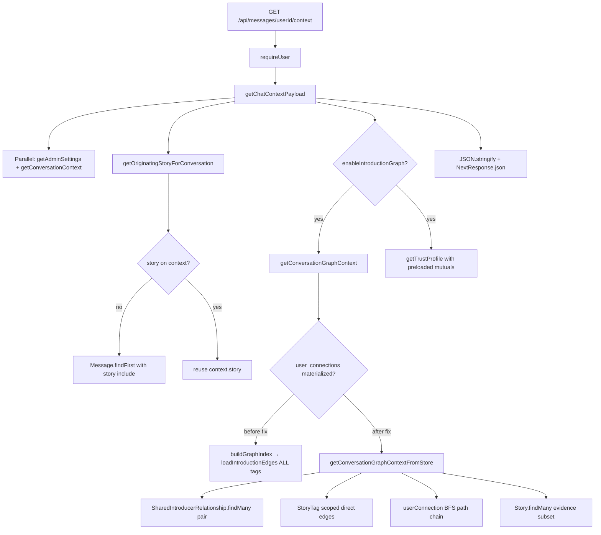

# Message Context Performance Investigation

Generated: 2026-06-22  
Route: `GET /api/messages/[userId]/context`

## Executive summary

At **500 simulation users**, the Message Context endpoint reported **~243ms Prisma** (warm production benchmark) vs **~70ms** at 250 users. Root cause: **`loadIntroductionEdges()`** performed a **full-table `StoryTag.findMany`** on every request to build an in-memory introduction graph, scaling **O(tags)** with dataset size (~3,500+ published tags at 500 users).

Auth (~250ms TTFB) is unchanged and out of scope for this task.

---

## Call graph

---

## Query inventory (before optimization)

| # | Query | Source | Issue |
| - | ----- | ------ | ----- |
| 1 | `User.findUnique` | `requireUser` | Required (auth) |
| 2 | `Message.findFirst` | `canAccessChatContext` | **Duplicate** with payload load |
| 3 | `AdminSettings.findUnique` | `getAdminSettings` | Required |
| 4 | `ConversationContext.findUnique` + includes | `getConversationContext` | Required |
| 5 | `StoryTag.findMany` (ALL published tags) | `loadIntroductionEdges` | **P0 bottleneck — O(n) table scan** |
| 6 | `Story.findMany` | evidence / path meta | Scoped but triggered by graph |
| 7 | `User.findMany` | path chain / related | Moderate |
| 8 | `UserConnection.findUnique` | trust depth | Indexed — fast |
| 9 | `SharedIntroducerRelationship.findMany` | trust + mutual (×2) | **Duplicate pair fetch** |
| 10 | `SharedIntroducerRelationship.count` | trust fallback | Avoidable when row exists |

**Estimated Prisma executions:** 12–15 per request (warm), dominated by query #5 row volume.

---

## Timing breakdown (measured, pre-fix)

Source: `docs/.scale-progression-results.json` (500 users, production warm median)

| Segment | 250 users | 500 users | Growth |
| ------- | --------- | --------- | ------ |
| TTFB | 329ms | 496ms | +51% |
| Auth | 254ms | 242ms | flat |
| **Prisma** | **70ms** | **243ms** | **+247%** |
| Server total | 73ms | 253ms | +247% |

Page routes (`prismaMs: 0` in headers) unchanged — Message Context is the first route where graph load surfaced in Prisma headers.

---

## Bottleneck ranking

| Rank | Bottleneck | Impact | Scaling |
| ---- | ---------- | ------ | ------- |
| **P0** | Full `StoryTag` scan in `loadIntroductionEdges` | ~150–200ms+ at 500 users | **O(n)** tags |
| **P1** | Duplicate `SharedIntroducerRelationship` (graph + trust) | ~10–20ms | O(pair mutuals) |
| **P1** | Duplicate `Message.findFirst` (access + payload) | ~5–10ms | O(1) |
| **P2** | Path-chain BFS per-node neighbor queries (pre-batch) | Variable | O(frontier × queries) |
| **P3** | Large JSON graph payload serialization | ~5ms | O(mutual count) |

---

## N+1 and scan patterns

1. **Full graph scan:** Every request loaded all introduction edges — classic **large scan**, not N+1 but worse at scale.
2. **Thundering herd (prior fix):** Multiple `buildGraphIndex()` calls per request — already fixed in earlier pass; 500-user regression was scan size, not duplicate builds.
3. **Path BFS (pre-batch):** Up to 2 queries × frontier size per depth — mitigated with batched `userConnection` neighbor fetch.
4. **Trust duplicate:** `getSharedIntroducersForPair` repeated pair query already done for mutual introducers.

---

## Recommended fixes (implemented)

See `docs/MESSAGE_CONTEXT_OPTIMIZATIONS.md`.

1. **Materialized fast path:** `getConversationGraphContextFromStore` when `user_connections` populated.
2. **Pair-scoped queries:** Mutual introducers from `shared_introducer_relationships`; direct edges via targeted `StoryTag` OR clause.
3. **BFS on `user_connections`:** Path chain without full edge load; batched neighbor queries per BFS level.
4. **Trust preload:** Pass mutual introducers into `getTrustProfile` to skip duplicate pair fetch.
5. **Route dedup:** Access check merged into `getChatContextPayload` (single context/message probe).

---

## Indexes (existing, verified)

| Table | Index | Used by fast path |
| ----- | ----- | ----------------- |
| `shared_introducer_relationships` | `(user_a_id, user_b_id)` | Mutual lookup |
| `user_connections` | `(source_user_id, degree)` | BFS neighbors |
| `user_connections` | `(source_user_id, target_user_id)` unique | Depth lookup |
| `story_tags` | story FK | Scoped direct-edge query |

No new migration required for this optimization pass.

---

*Profiling tools: `npm run profile:production`, `npm run profile:message-context`*
