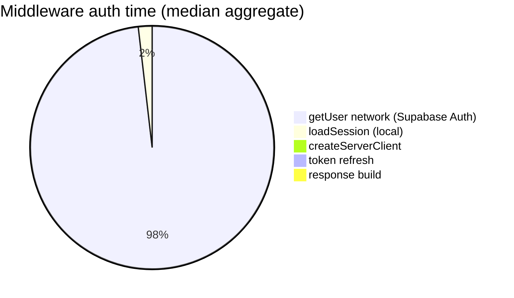

# Middleware Auth Instrumentation Report

Generated: 2026-06-22T17:31:53.123Z

Scope: **Measurement only** — no JWT verification, no auth behavior changes, no security model changes.

Environment: `next start` with `PROFILE_PRODUCTION=1`  
Base URL: `http://localhost:3005`  
Warm runs per route: 5 (median reported)  
User: `user1@friendintro.com`

---

## Executive summary

Middleware auth on authenticated routes spends **~276ms** total (median across profiled routes). **97%** of that time is **network RTT to Supabase Auth `GET /auth/v1/user`** inside `auth.getUser()`.

| Phase | Median ms | Share of total auth |
| ----- | --------- | ------------------- |
| `createServerClient()` | 1ms | 0% |
| Cookie/session load (local, inside getUser) | 5ms | 2% |
| `auth.getUser()` → `GET /auth/v1/user` | 269ms | 97% |
| Token refresh → `POST /auth/v1/token` | 0ms | 0% |
| Response build (headers, redirects) | 0ms | 0% |
| **Total middleware auth** | **276ms** | **100%** |

**Is `auth.getUser()` the dominant cost?** **Yes** — network verification to Supabase Auth accounts for ≥70% of middleware auth time.

---

## 1. Segment breakdown by route

Headers emitted (when `PROFILE_PRODUCTION=1` or `AUTH_PROFILE=1`):

| Header | Phase |
| ------ | ----- |
| `x-auth-create-client-ms` | `createServerClient()` |
| `x-auth-session-ms` | Local cookie/session parsing inside getUser |
| `x-auth-get-user-ms` | `GET /auth/v1/user` network time |
| `x-auth-refresh-ms` | `POST /token` refresh network time |
| `x-auth-response-ms` | Trusted headers + NextResponse rebuild |
| `x-auth-profile-middleware-ms` | Total middleware wall time |

| Route | Total auth | createClient | loadSession | getUser (network) | refresh (network) | responseBuild | getUser % |
| ----- | ---------- | ------------ | ----------- | ----------------- | ----------------- | ------------- | --------- |
| /home | 273ms | 1ms | 5ms | 266ms | 0ms | 0ms | 97% |
| /discoveries | 277ms | 1ms | 6ms | 267ms | 0ms | 0ms | 96% |
| /profile | 274ms | 1ms | 5ms | 267ms | 0ms | 1ms | 97% |
| /api/messages/da9ffce0-bbb9-4cd8-9e2f-5d774707506d/context | 280ms | 0ms | 5ms | 276ms | 0ms | 0ms | 99% |

### Comparison to prior production baseline

| Route | Baseline total | Baseline auth | Measured middleware auth | Delta vs baseline auth |
| ----- | -------------- | ------------- | -------------------------- | ---------------------- |
| /home | 294ms | 251ms (baseline) | 273ms (measured) | +22ms |
| /discoveries | 320ms | 251ms (baseline) | 277ms (measured) | +26ms |
| /profile | 343ms | 299ms (baseline) | 274ms (measured) | -25ms |
| /api/messages/da9ffce0-bbb9-4cd8-9e2f-5d774707506d/context | 323ms | 304ms (baseline) | 280ms (measured) | -24ms |

---

## 2. Phase attribution (answers to investigation goals)

| Question | Finding |
| -------- | ------- |
| 1. `createServerClient()` cost? | **~1ms** (0%) — negligible |
| 2. Cookie/session loading? | **~5ms** (2%) — local JWT parse + cookie read |
| 3. Token refresh? | **~0ms** (0%) — refresh not triggered on warm requests with valid session |
| 4. `auth.getUser()` total? | **~274ms** (network + local) |
| 5. Network RTT to Supabase Auth? | **~269ms** measured in middleware; standalone probe: **~260ms** (`GET /auth/v1/user`) |

---

## 3. Region audit — Supabase vs deployment

| Setting | Value |
| ------- | ----- |
| `NEXT_PUBLIC_SUPABASE_URL` | https://ssviggmfvffaxhibejyk.supabase.co |
| Project ref | ssviggmfvffaxhibejyk |
| DB pooler region (`aws-0-*`) | Local dev — `DATABASE_URL` host is `localhost` (not Supabase pooler) |
| Inferred Supabase region | **Remote project** (`ssviggmfvffaxhibejyk.supabase.co`) — confirm region in Supabase dashboard → Project Settings → Infrastructure |
| Deployment region (env hints) | **local (next start on developer machine — not production deployment region)** |
| Direct `GET /auth/v1/health` RTT (client → Supabase) | **~250ms** median |
| Direct `GET /auth/v1/user` RTT (client → Supabase) | **~260ms** median |

### RTT impact estimate

- Middleware `getUser()` network segment (~**269ms**) closely tracks standalone Auth API RTT (~**260ms**).
- This benchmark ran on a **local Windows dev machine** with Auth hosted on Supabase cloud — the ~260ms RTT is almost entirely **client→Supabase Auth network latency**, not application code.
- Production deployment region was not available in env vars (`VERCEL_REGION`, etc. unset). Compare your host region to the Supabase project region in the dashboard; cross-region adds **+80–150ms** per hop.

---

## 4. Matcher exclusion audit

Current matcher excludes: `_next/static`, `_next/image`, `favicon.ico`, `robots.txt`, `sitemap.xml`, `api/public/*`.

Proposed exclusions (analysis only — **not implemented**):

| Path | Status | Middleware runs today? | Safe to exclude? |
| ---- | ------ | ---------------------- | ---------------- |
| /api/health | 307 → `/login` | **yes** (~3ms auth, no session) | Load balancer / uptime probe — no user context needed |
| /manifest.webmanifest | 307 → `/login` | **yes** (~2ms auth, no session) | PWA manifest — static metadata |
| /offline | 307 → `/login` | **yes** (~1ms auth, no session) | Service worker offline fallback page |
| /icons/icon-512.svg | 307 → `/login` | **yes** (~1ms auth, no session) | PWA icon asset |

**307 note:** Benchmark used `redirect: manual`. Without session cookies, middleware runs `getUser()` (fast — no Auth HTTP), then **redirects unauthenticated users to `/login`** because these paths are not in `isPublic`. Fetch clients that follow redirects silently hit the login page instead of the intended resource. Excluding them from the matcher fixes both the redirect bug and middleware overhead.

### Estimated savings from matcher narrowing (per hit)

| Path | Unauthenticated overhead today | With session cookie (worst case) | Risk |
| ---- | ------------------------------ | -------------------------------- | ---- |
| `/api/health` | ~3ms middleware + broken 307 redirect | ~276ms full auth | Low — handler is public |
| `/manifest.webmanifest` | ~2ms + 307 redirect | ~276ms | Low — static metadata |
| `/offline` | ~1ms + 307 redirect | ~276ms | Low — SW fallback must be public |
| `/icons/*` | ~1ms + 307 redirect | ~276ms | Low — static assets |

**Security notes:**

- `/api/health`: Public JSON health check; handler uses Prisma/admin Supabase — **does not need session cookies**. Excluding from middleware is safe; probes today either follow redirects to `/login` or pay auth if cookies are present.
- `/manifest.webmanifest`: Static PWA metadata via `app/manifest.ts` — **no auth**. Safe to exclude.
- `/offline`: Public offline fallback for service worker — **no auth**. Safe to exclude.
- `/icons/*`: Static assets under `public/icons/` — **no auth**. Safe to exclude (use `icons/` prefix in matcher negative lookahead).

Authenticated routes (`/home`, `/discoveries`, etc.) **must remain** in middleware until a replacement auth strategy exists.

---

## 5. Estimated savings (no implementation in this task)

| Optimization | Estimated saving | Risk | Notes |
| ------------ | ---------------- | ---- | ----- |
| Matcher exclude health/manifest/offline/icons | ~1–3ms per unauthenticated hit; fixes 307→login redirect; up to ~276ms if session cookie sent | Low | Does not affect authenticated app pages |
| Colocate deployment with Supabase region | Up to RTT delta (~219ms if misaligned) | Ops | Compare deployment region env vs `unknown (check Supabase dashboard → Project Settings → Infrastructure)` |
| Local JWT verification (future — **not done**) | ~269ms per matched request | Medium | Requires JWKS cache + expiry handling; out of scope |
| Skip middleware on public pages only | Variable | **High** if misconfigured | Public pages still call `getUser()` today for optional session — needs design review |

---

## Methodology

- Instrumentation: `lib/middleware-auth-timing.ts` + `lib/supabase/middleware.ts`
- Fetch patching attributes `/auth/v1/user` and `/auth/v1/token` without changing call semantics
- Script: `npm run profile:middleware-auth`
- JSON artifact: `docs/.middleware-auth-benchmark.json`

*Disable headers in production deployments: unset `PROFILE_PRODUCTION` and `AUTH_PROFILE`.*
