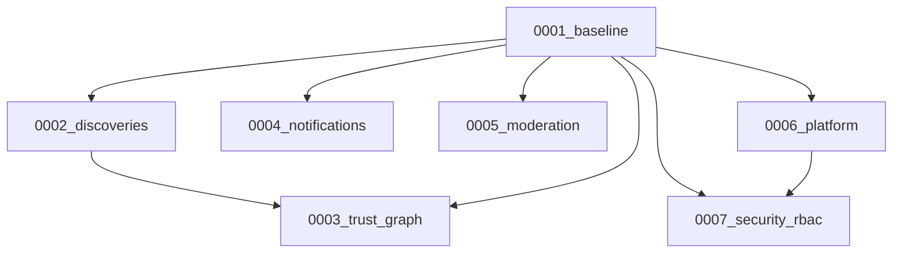

# BuddyIntro Migration History Rebuild

**Date:** 2026-07-14  
**Branch:** `migration-history-rebuild`  
**Backup branch:** `migration-history-backup`

## Objective

Replace broken migration ordering (baseline running after feature migrations) with a deterministic chain that initializes an **empty PostgreSQL database** via `npx prisma migrate deploy` alone.

## Source of truth

`prisma/schema.prisma` — not modified during this rebuild.

## New migration structure

| Migration | Purpose |
|-----------|---------|
| `0001_baseline` | All enums + core tables: users, stories, invitations, messages, posts, admin_settings, user_consents |
| `0002_discoveries` | Discoveries feed tables + conversation_contexts |
| `0003_trust_graph` | user_connections, introduction_categories, shared_introducer_relationships + category seed |
| `0004_notifications` | notifications, preferences, push, analytics |
| `0005_moderation` | verification challenges, blocks, content reports |
| `0006_platform` | background_jobs |
| `0007_security_rbac` | roles, permissions, RBAC tables, audit/security events + seed |

## Dependency graph



Foreign keys that cross domains are placed in the **later** migration of the two involved tables (e.g. `stories → introduction_categories` FK lives in `0003_trust_graph`).

## Removed / archived

Moved to `prisma/migrations_archive/pre-rebuild-2026-07-14/`:

- `2026_baseline` through `202615_performance_indexes` (12 numbered folders)
- Standalone SQL: `platform_extension.sql`, `introduction_graph_and_context.sql`, etc.

**Merged into new chain:**

| Old migrations | New home |
|----------------|----------|
| `2026_baseline` + `2026_database_alignment` | `0001_baseline`, `0002_discoveries` |
| `202606` + `202613` | `0003_trust_graph` (final visibility enum) |
| `202607` | `0004_notifications` |
| `202608` | `0005_moderation` |
| `202609` + `202606` platform cols | `0001_baseline` (users), `0006_platform` |
| `202610` + `202615` partial indexes | **Not included** — not in `schema.prisma` (no extra objects) |
| `202611` storage hardening | **Not included** — Supabase-specific; remains in `policies.sql` |
| `202612` RBAC | `0007_security_rbac` |
| `202614` discoveries UX | **Not included** — admin_settings columns already in full schema baseline |

## Intentionally outside Prisma migrations

- `prisma/policies.sql` — RLS (run `npm run db:rls` after deploy)
- Supabase storage policies from old `202611`

## Validation

| Check | Result |
|-------|--------|
| `0001_baseline` executes first | ✓ |
| No early FK to undiscovered tables | ✓ |
| `tests/migrations.test.js` | ✓ pass |
| `prisma migrate diff` drift check | Requires `DIRECT_URL` / `SHADOW_DATABASE_URL` |
| `MIGRATION_TEST_RESET=1` full deploy | Run on empty DB before production cutover |
| Deployment pipeline (`prisma migrate deploy` in deploy.js) | ✓ unchanged |

## Scripts added

- `scripts/archive-migrations.js` — archive old folders
- `scripts/split-migration-sql.js` — split Prisma diff into ordered migrations
- `scripts/validate-migrations.js` — drift + optional reset validation

## Production cutover (empty database)

```bash
npm install
npx prisma migrate deploy
npx prisma generate
npm run build
npm run db:rls
```

## Archive safety

The archive at `prisma/migrations_archive/` is **safe to remove only after** production validation on an empty database succeeds. It is not removed automatically.
