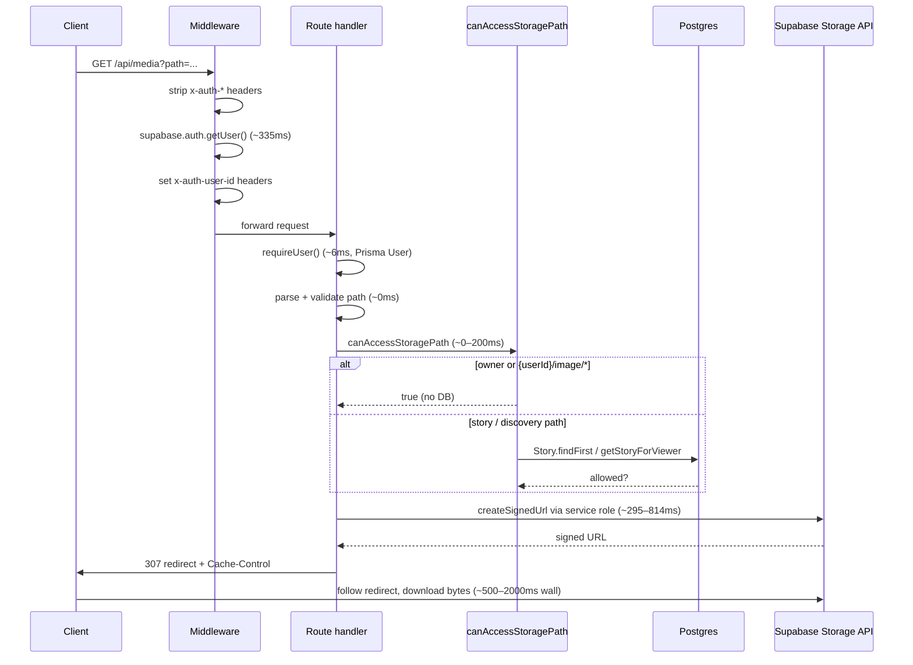
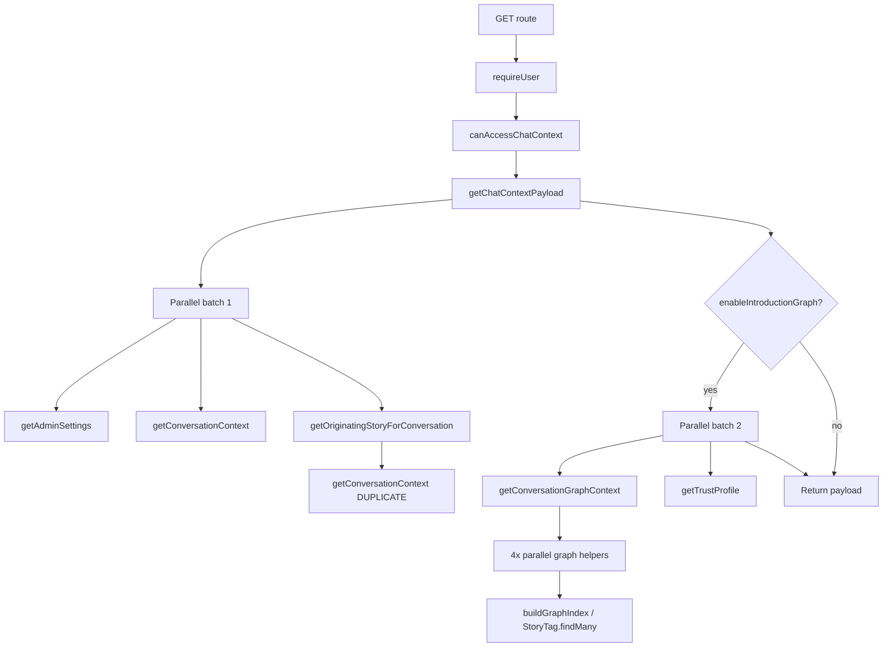

# Phase 2A: Media and Messages Optimization Report

Generated: 2026-06-21  
Scope: Analysis only — **no implementation**  
Source data: [`docs/PHASE2_PROFILING_REPORT.md`](PHASE2_PROFILING_REPORT.md), code trace, warm `[PROFILE]` logs (`PROFILE_PHASE2=1`)

---

## Executive summary

| Route | Handler bottleneck | Largest fixable win |
| ----- | ------------------ | ------------------- |
| `/api/media` | Supabase `createSignedUrl` (295–814ms) | Signed-URL cache (~300–800ms/hit) |
| `/api/messages/[userId]/context` | Graph Prisma fan-out (~15 queries, ~55ms segment) | Dedupe queries + single graph index load (~80–200ms) |

Middleware auth (~270–380ms) dominates **both** routes end-to-end. This report focuses on the **non-auth** latency called out in Phase 2 profiling.

---

# Part 1: `/api/media`

## Request execution trace



### Step-by-step timing (warm measured)

| Step | Code location | Measured ms | Notes |
| ---- | ------------- | ----------- | ----- |
| Middleware auth | `lib/supabase/middleware.ts` | **335** | Not handler; included in end-to-end |
| Route auth | `requireUser()` → `getCurrentUser()` | **6** | Phase 1 headers; ~5ms Prisma |
| Query parse / validation | `route.ts` | **0** | Sync |
| Access control | `canAccessStoragePath()` | **0–1** | Fast path for own files + `{userId}/image/*` |
| **Supabase sign URL** | `signStoragePath()` → `createSignedUrl` | **295–814** | **Dominates handler** |
| Redirect construction | `NextResponse.redirect()` | **0–1** | Sync |
| **Handler total** | `[PROFILE] total` | **302–832** | |
| Client wall (median, follows redirect) | `profile:phase2` script | **2352** | Includes asset download |

### What is *not* in the hot path (avatar / own-file case)

- No Postgres lookup when `viewerId === ownerId` or path is `{anyUserId}/image/*`
- No storage object HEAD/exists check before signing — missing objects still pay full sign RTT then return 404

### Storage configuration (security context)

From `prisma/policies.sql` and migration `202611_security_hardening`:

- Bucket `friendintro` is **private** (`public: false`)
- Storage RLS `select` allows only `auth.uid() = path prefix owner`
- App uses **service-role** `createSignedUrl` in `lib/storage-signed.ts` to bypass RLS after app-level ACL in `canAccessStoragePath`

All client media URLs are proxied via `/api/media?path=…` (`lib/storage-url.ts` → `resolveMediaUrlForClient`).

---

## Option analysis

### A. Cache signed URLs

| | |
| --- | --- |
| **Approach** | In-memory (or Redis) map: `path → { url, expiresAt }`, TTL ≤ 50 min (URLs expire in 3600s) |
| **Can it work?** | **Yes** — path is stable; authz already enforced before sign |
| **Invalidation** | On upload/delete to same path; optional user-scoped cache key |
| **Est. savings** | **295–814ms per cache hit** (eliminates Supabase API call) |
| **Complexity** | **Medium** — new cache module, TTL, invalidation hooks in upload paths |
| **Risk** | Low if TTL < signed expiry and ACL runs before cache lookup |

### B. Public URLs instead of signed URLs

| Path type | Public URL feasible? | Rationale |
| --------- | -------------------- | --------- |
| `{userId}/image/*` (avatars) | **Partially** | App already allows any authed user to view; could add storage policy for public read on `image/` prefix |
| Story / discovery media | **No** | Visibility is story/post-specific; must stay private |
| Voice notes | **No** | Same as stories |

| | |
| --- | --- |
| **Approach** | Split bucket policies: public read for avatars; keep signed URLs for private media |
| **Est. savings** | **~300–800ms** on avatar hits (~high traffic: profile pics, story thumbnails in lists) |
| **Complexity** | **Medium–High** — policy change, URL format migration, CDN exposure review |
| **Risk** | **Medium** — avatar URLs become guessable/enumerable (`/{uuid}/image/...`); acceptable for many apps, not for sensitive images |

**Verdict:** Public URLs are viable **only for avatar paths**, not as a full replacement for signed URLs.

### C. Remove server redirect (307)

| | |
| --- | --- |
| **Current** | `NextResponse.redirect(signedUrl)` — browser/img tag hits app, then Supabase |
| **Alternative 1** | Return `200 JSON { url }` — client sets `img.src` to signed URL directly |
| **Alternative 2** | Stream/proxy bytes through app — ** worse** (adds app bandwidth) |
| **Alternative 3** | Keep redirect; improve `Cache-Control` on redirect (already `max-age=300`) |

| | |
| --- | --- |
| **Est. savings** | **100–500ms perceived** (one fewer same-origin hop before CDN); server sign time unchanged |
| **Complexity** | **Low–Medium** — API contract change + update `resolveMediaUrlForClient` consumers |
| **Risk** | Low — signed URL still short-lived; expose Supabase host to client (already true after redirect) |

**Verdict:** Removing redirect does **not** remove `createSignedUrl` cost on the server, but **does** reduce client wall time and TTFB for `` patterns.

### D. Singleton Supabase admin client

| | |
| --- | --- |
| **Issue** | `createSupabaseAdminClient()` on every `signStoragePath()` call |
| **Est. savings** | **1–5ms** (client construction only) |
| **Complexity** | **Low** |
| **Risk** | None |

### E. Pre-sign / batch at write time

| | |
| --- | --- |
| **Approach** | Store signed URL or long-lived token when uploading |
| **Est. savings** | High on read path |
| **Complexity** | **High** — expiry management, storage schema |
| **Risk** | Medium — stale URLs, revocation |

---

## `/api/media` — ranked recommendations

| Rank | Recommendation | Est. handler savings | Client wall savings | Complexity | Priority |
| ---- | -------------- | -------------------- | ------------------- | ---------- | -------- |
| **1** | **Signed-URL cache** (path-keyed, TTL 45–50m) | **300–800ms** | **300–800ms** | Medium | **P0** |
| **2** | **Return signed URL JSON** (or optional `?format=json`) instead of 307 for API consumers | 0ms server | **100–500ms** | Low–Med | **P1** |
| **3** | **Public read policy for `{userId}/image/*` only** + direct public URLs for avatars | **300–800ms** on avatars | Same | Med–High | **P2** |
| **4** | Singleton service-role Supabase client | 1–5ms | — | Low | **P3** |
| **5** | HEAD/exists check before sign (fail fast) | Saves sign RTT on 404 | Small | Low | **P3** |

### Expected combined impact (warm, avatar-heavy traffic)

| Scenario | Before (handler) | After (#1 + #2) | After (#1 + #2 + #3 avatars) |
| -------- | ---------------- | --------------- | ---------------------------- |
| Cache miss | ~637ms | ~637ms | ~637ms (stories) / **~10ms** (public avatars) |
| Cache hit | ~637ms | **~10ms** | **~10ms** |
| Client wall (img load) | ~2350ms | **~1200–1800ms** | **~200–800ms** (avatars) |

---

# Part 2: `/api/messages/[userId]/context`

## Request execution trace



### Handler timing breakdown (warm, graph enabled)

| Segment | ms | % of handler (~62ms) |
| ------- | -- | -------------------- |
| Route auth (`requireUser`) | 6 | 10% |
| Access control | 0 | 0% |
| Chat context payload | 55 | **89%** |
| Serialize + response | 0 | 0% |
| **Handler total** | **62** | |
| + Middleware auth | +305 | (end-to-end ~367ms) |

---

## Complete Prisma query inventory

Queries below occur on a **typical warm request** with existing messages, graph enabled, and materialized connections present (from profiling + static trace).

### Route layer

| # | Query | Trigger | Count | Est. ms |
| --- | ----- | ------- | ----- | ------- |
| 1 | `User.findUnique` | `requireUser()` / `getCurrentUser()` | 1 | ~5 |
| 2 | `Message.findFirst` | `canAccessChatContext()` — proves conversation exists | 0–1 | 0–10 |

### `getChatContextPayload` — batch 1 (parallel)

| # | Query | Trigger | Count | Est. ms |
| --- | ----- | ------- | ----- | ------- |
| 3 | `AdminSettings.findUnique` | `getAdminSettings()` (60s cache) | 0–1 | 0–18 |
| 4 | `ConversationContext.findUnique` + includes | `getConversationContext()` | 1 | ~19 |
| 5 | `ConversationContext.findUnique` + includes | `getOriginatingStoryForConversation()` re-calls `getConversationContext()` | **1 duplicate** | ~19 |
| 6 | `Message.findFirst` + story include | Only if context has no story | 0–1 | 0–15 |

### Graph block — `getConversationGraphContext` (parallel inner)

| # | Query | Trigger | Count | Est. ms |
| --- | ----- | ------- | ----- | ------- |
| 7 | `StoryTag.findMany` | `loadIntroductionEdges()` via `buildGraphIndex()` | **1–5*** | ~10–97 each |
| 8 | `Story.findMany` | `loadStoryMetaByIds()` in `getIntroductionEvidence()` | 0–1 | ~10–30 |
| 9 | `User.findMany` | Evidence + path chain + related intros | 2–3 | ~10–20 |
| 10 | `User.findUnique` | `getIntroductionPathChain()` (edge case) | 0–1 | ~5 |
| 11 | `UserConnection.findFirst` | `isUserConnectionsMaterialized()` | 1 | ~5 |
| 12 | `UserConnection.findUnique` | `getConnectionDegreeFromStore()` | 0–1 | ~17 |

\*Profiling observed **`StoryTag.findMany` ×5 (484ms cold, 53ms warm)** — see thundering herd below.

### Trust profile (parallel with graph, if `showSharedIntroducers`)

| # | Query | Trigger | Count | Est. ms |
| --- | ----- | ------- | ----- | ------- |
| 13 | `SharedIntroducerRelationship.findMany` + includes | `getSharedIntroducersForPair()` | 1 | ~14 |
| 14 | `User.findUnique` | Other user verification fields | 1 | ~5 |
| 15 | `UserConnection.findUnique` | Trust score / degree row | 1 | ~17 |
| 16 | `SharedIntroducerRelationship.count` | Fallback if no connection row | 0–1 | ~8 |

**Total: ~12–18 distinct DB round-trips; ~15 counted in profiling.**

---

## Issues detected

### 1. Duplicate query — `ConversationContext.findUnique` ×2

**Root cause:** `getChatContextPayload` parallelizes:

```ts
getConversationContext(viewerId, otherUserId),
getOriginatingStoryForConversation(viewerId, otherUserId), // internally calls getConversationContext again
```

**Impact:** ~19–38ms wasted; doubles include work (story + discoveriesPost + user joins).

---

### 2. Thundering herd — `StoryTag.findMany` ×5

**Root cause:** `getConversationGraphContext` starts four helpers in parallel:

```ts
await Promise.all([
  getMutualIntroducers(),      // → buildGraphIndex()
  getIntroductionPath(),       // → getMutualIntroducers() → buildGraphIndex()
  getIntroductionPathChain(),  // → buildGraphIndex()
  getConnectionReason(),       // → getIntroductionEvidence() + getMutualIntroducers() + getConnectionDepth() + buildGraphIndex()
]);
```

`buildGraphIndex` uses React `cache()`, but **parallel invocations before the first resolves** can each trigger `loadIntroductionEdges()` → duplicate full-table `StoryTag.findMany`.

**Impact:** Up to **5× graph edge load** (profiling: 484ms cold / 53ms warm aggregate).

---

### 3. Redundant CPU work — `getMutualIntroducers` called 4+ times

Even when `buildGraphIndex` is cached, each helper recomputes mutual introducer lists from the in-memory index.

**Impact:** CPU + latency under load; not always extra queries but blocks event loop.

---

### 4. Overlapping trust data

When `showSharedIntroducers` is on, `getTrustProfile()` loads `SharedIntroducerRelationship` while graph code computes mutual introducers from `StoryTag` edges — **two sources of truth** for related data.

**Impact:** Extra ~14–25ms Prisma + duplicate conceptually.

---

### 5. Expensive includes on context row

`ConversationContext.findUnique` always includes full `story` (with tags/users) and `discoveriesPost` even when graph path will supply story metadata separately.

**Impact:** ~10–30ms on wide rows.

---

### 6. Sequential graph phase

Graph + trust run **after** batch 1 completes. Access control + batch 1 could theoretically overlap more, but batch 1 is required first.

**Impact:** Minor (~0ms today since access is fast when messages exist).

---

### 7. Repeated `User.findUnique`

| Call site | Purpose |
| --------- | ------- |
| `requireUser()` | Session user |
| `canAccessChatContext()` | Only on cold path (no messages) |
| `getTrustProfile()` | Other user verification |
| `getIntroductionPathChain()` | Edge case self-view |

**Impact:** ~10–20ms on cold paths; ~5ms extra on warm trust path.

---

## Proposed optimized query plan

### Target architecture (single request)

```
1. requireUser()                                    → User.findUnique ×1
2. canAccessChatContext()                           → Message.findFirst ×1 (or skip if merged)
3. Parallel {
     getAdminSettings()                              → cached
     getConversationContextWithStory()               → ConversationContext.findUnique ×1 (slim include)
   }
4. If no story on context → Message.findFirst ×1    → conditional
5. buildGraphIndex() ONCE                           → StoryTag.findMany ×1
6. Parallel in-memory {
     mutualIntroducers, paths, pathChain, connectionReason  → 0 extra edge queries
     trustFromMaterializedTables                           → UserConnection + SharedIntroducer ×1 each
   }
7. Assemble payload
```

### Query budget comparison

| | Current (warm) | Optimized target |
| --- | -------------- | ---------------- |
| `StoryTag.findMany` | 1–5 | **1** |
| `ConversationContext.findUnique` | 2 | **1** |
| `User.findUnique` | 3 | **2** |
| `UserConnection.*` | 2–3 | **2** |
| `SharedIntroducerRelationship.*` | 1–2 | **1** |
| Other | 2–4 | 1–3 |
| **Total round-trips** | **~15** | **~8–10** |
| **Est. Prisma time** | **~55–161ms** | **~25–60ms** |

---

## `/api/messages/.../context` — ranked recommendations

| Rank | Recommendation | Est. savings | Complexity | Notes |
| ---- | -------------- | ------------ | ---------- | ----- |
| **1** | **Single `buildGraphIndex()`** at start of `getConversationGraphContext`; pass index to all helpers | **40–150ms** (cold herd) | Medium | Fixes ×5 `StoryTag.findMany` |
| **2** | **Pass context row** into `getOriginatingStoryForConversation` — eliminate duplicate fetch | **15–35ms** | Low | One-line API change + param |
| **3** | **Compute graph facets from one `getMutualIntroducers` result** (paths/reasons derive from same data) | **10–30ms** CPU | Medium | Refactor graph helpers |
| **4** | **Slim `ConversationContext` include** — defer story tags until needed | **10–25ms** | Medium | Lazy load or select fewer columns |
| **5** | **Unify trust + graph shared introducers** — prefer materialized `SharedIntroducerRelationship` when populated | **15–25ms** | Medium–High | Avoid dual graph paths |
| **6** | **Merge access check** — use existence of context/messages in one query | **5–15ms** | Low–Med | Only when no prior messages |
| **7** | **Cache chat context per pair** (short TTL, invalidate on new message) | **~50ms** on repeat | Medium | High value for active chats |
| **8** | **SSR / client seed** context on message page open | Eliminates fetch | High | Product change |

### Expected handler impact (warm, graph on)

| Metric | Before | After (#1–#4) | After (all P1–P2) |
| ------ | ------ | ------------- | ----------------- |
| Handler total | ~62ms | **~35–45ms** | **~25–35ms** |
| Prisma segment | ~55ms | **~25–35ms** | **~20–30ms** |
| End-to-end (+ middleware) | ~367ms | **~340–355ms** | **~330–345ms** |

Middleware auth remains **~83%** of end-to-end until addressed platform-wide.

---

# Cross-cutting notes

## What Phase 2A does *not* fix

- **Middleware Supabase RTT (~300ms)** — unchanged by media/messages optimizations
- **Dev compilation** on first route hit
- **Client redirect download time** for `/api/media` unless redirect removed or URLs cached client-side

## Suggested implementation order (when approved)

1. **Media signed-URL cache** — isolated, high ROI, low regression risk  
2. **Messages: dedupe ConversationContext + single graph index** — low–medium risk refactors  
3. **Media JSON URL response** — client contract update  
4. **Messages: graph helper consolidation + trust unification**  
5. **Avatar public URL policy** — security review gate  

---

## Appendix: measured `[PROFILE]` samples (warm)

### `/api/media` (200/307, valid story image)

```text
middlewareAuth=335 ms
routeAuth=6 ms
external=295 ms        ← createSignedUrl
accessControl=0 ms
total=302 ms             ← handler only
```

### `/api/messages/[userId]/context`

```text
middlewareAuth=305 ms
routeAuth=6 ms
chatContext=55 ms
prisma[StoryTag.findMany] x5=53 ms
prisma[ConversationContext.findUnique] x2=38 ms
prisma[User.findUnique] x3=31 ms
total=62 ms              ← handler only
```

---

*Analysis complete. No code changes made. Proceed to implementation only after review of security implications (especially public avatar URLs and signed-URL cache invalidation).*
