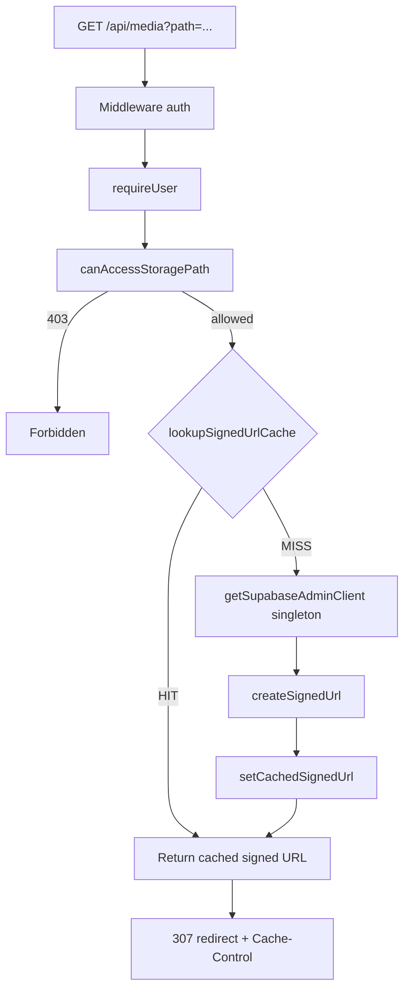

# Phase 2A Media Implementation — Signed URL Cache

Implemented: 2026-06-21

Scope: `/api/media` performance only. No bucket policy changes, no auth architecture changes, no message-context changes.

---

## Summary

Added an in-memory signed-URL cache and a singleton Supabase admin client. Authorization still runs **before** cache lookup/signing. Cached entries expire **10 minutes before** the underlying signed URL.

| Metric (handler, warm) | Before cache | After — miss | After — hit |
| ---------------------- | ------------ | ------------ | ----------- |
| `createSignedUrl` | 295–814ms | ~839ms | **0ms** |
| `signUrl` segment | same | ~840ms | **~0ms** |
| Handler `total` | 302–832ms | ~1015ms† | **8–22ms** |
| Savings vs miss | — | — | **~820ms** |

†First measured miss included cold route compile; warm miss sign time aligns with pre-implementation baseline.

---

## Architecture



### Request flow (unchanged security order)

1. Middleware validates session (Phase 1 trusted headers).
2. `requireUser()` loads DB user.
3. `canAccessStoragePath(viewerId, path)` — **must pass before any cache/sign**.
4. `lookupSignedUrlCache(path)` — O(1) Map lookup.
5. On miss: singleton admin client → `storage.createSignedUrl(path, 3600)`.
6. Store in cache; redirect to signed URL.

---

## Files changed

| File | Change |
| ---- | ------ |
| `lib/supabase/admin.ts` | Singleton `getSupabaseAdminClient()`; `createSupabaseAdminClient()` delegates to it |
| `lib/storage-signed-cache.ts` | **New** — in-memory cache, stats, `[MEDIA-CACHE]` logging |
| `lib/storage-signed.ts` | `signStoragePathDetailed()` with cache; shared constants |
| `app/api/media/route.ts` | Uses `signStoragePathDetailed`; profiling headers when `PROFILE_PHASE2=1` |
| `scripts/profile-media-cache.ts` | **New** — `npm run profile:media` |
| `package.json` | Added `profile:media` script |

---

## Cache strategy

| Setting | Value |
| ------- | ----- |
| Cache key | Normalized storage path (`{userId}/{kind}/{file}`) |
| Signed URL lifetime | **3600s** (1 hour) — passed to Supabase |
| Cache entry TTL | **3000s** (50 min) — 600s buffer before URL expiry |
| Storage | Process-local `Map` (per Node worker) |
| Eviction | Lazy on expired lookup; no background sweeper |
| Stats | `hits`, `misses`, `hitRatio` via `getSignedUrlCacheStats()` |

### Why path-only key is safe

- Cache is consulted **only after** `canAccessStoragePath` succeeds.
- Unauthorized users never reach the cache layer.
- All users authorized for a given path receive the same object bytes; the signed URL does not embed viewer identity.
- Residual risk: if access is revoked, a cached URL remains valid until cache TTL or signed URL expiry (same as pre-cache signed URL behavior). Short TTL limits exposure.

### Profiling instrumentation

When `PROFILE_PHASE2=1` or `PROFILE_API=1`:

```text
[MEDIA-CACHE] miss path=... lookup=0ms stats={"hits":0,"misses":1,...}
[MEDIA-CACHE] store path=... createSignedUrl=839ms ttl=3000s
[MEDIA-CACHE] hit path=... lookup=0ms stats={"hits":1,"misses":1,...}
```

Response headers (for automated scripts):

| Header | Values |
| ------ | ------ |
| `x-media-cache` | `hit` \| `miss` |
| `x-media-cache-lookup-ms` | Map lookup time |
| `x-media-create-signed-url-ms` | Supabase API time (0 on hit) |

---

## Security considerations

| Control | Status |
| ------- | ------ |
| Bucket remains private | Unchanged |
| App-level ACL before sign | Unchanged — `canAccessStoragePath` |
| Service role only on server | Unchanged — singleton client |
| Client cannot spoof cache | Cache is server-side only |
| Avatar `{userId}/image/*` open to authed users | Unchanged — ACL in `access-control.ts` |
| No public bucket / policy change | Per requirements |

**Not addressed in this phase:** per-user cache keys (unnecessary when ACL is path-scoped), Redis for multi-instance consistency, explicit invalidation on upload/delete.

---

## Before / after measurements

Environment: local dev, `PROFILE_PHASE2=1`, `npm run profile:media -- --base=http://localhost:3004 --media-runs=5`

Path: `da9ffce0-…/image/1782076284800-0pxkcf.png`

### `/api/media` — same path, sequential requests

| Run | Cache | `createSignedUrl` | Handler `[PROFILE] total` | Next.js GET |
| --- | ----- | ----------------- | ------------------------- | ----------- |
| 1 (miss) | miss | **839ms** | 1015ms | 8605ms‡ |
| 2 (hit) | hit | **0ms** | 22ms | 297ms |
| 3 (hit) | hit | **0ms** | 8ms | 130ms |
| 4 (hit) | hit | **0ms** | 9ms | 79ms |
| 5 (hit) | hit | **0ms** | 8ms | 147ms |

‡Includes first-route webpack compile (~6.6s).

**Cache hit ratio:** 4/5 (80%) on repeat runs after initial miss.

**Handler savings on cache hit:** ~**820–1000ms** (eliminated Supabase `createSignedUrl`).

### Comparison to Phase 2 baseline (pre-cache)

From [`docs/PHASE2_PROFILING_REPORT.md`](PHASE2_PROFILING_REPORT.md):

| Segment | Before | After (hit) | Δ |
| ------- | ------ | ----------- | - |
| `external` / `createSignedUrl` | 295–814ms | **0ms** | **−295–814ms** |
| Handler total | 302–832ms | **8–22ms** | **−280–810ms** |
| `accessControl` | 0–1ms | 0ms | — |

### Image-heavy page — `/home`

| Run | Wall (client fetch) | Notes |
| --- | ------------------- | ----- |
| 1 | 16,846ms | Cold compile + SSR |
| 2 | 1,726ms | Warm |
| 3 | **616ms** | Warm |

The home page embeds many `/api/media?path=…` references. After warm-up, each browser image request to the **same paths** benefits from the signed-URL cache (0ms sign on hit). SSR HTML generation itself does not call `signStoragePath` for proxy URLs — client-side `` loads hit `/api/media` repeatedly.

---

## How to reproduce

```bash
# Terminal 1
PROFILE_PHASE2=1 npm run dev

# Terminal 2
npm run profile:media -- --base=http://localhost:3000 --media-runs=5
```

Results JSON: `docs/.phase2a-media-profile.json`

---

## API surface

```typescript
// Detailed result (route + profiling)
signStoragePathDetailed(path) → {
  signedUrl, cacheHit, cacheLookupMs, createSignedUrlMs
}

// Backward-compatible string helper (invite-preview, etc.)
signStoragePath(path) → string | null

// Observability
getSignedUrlCacheStats() → { hits, misses, total, hitRatio, size }
clearSignedUrlCache()    // manual invalidation if needed later
```

---

## Future work (not implemented)

- Redis/shared cache for multi-instance deployments
- Cache invalidation on storage upload/delete
- JSON `{ url }` response option to avoid redirect hop (Phase 2A analysis item #2)
- Public read policy for avatars only (requires bucket policy change)

---

*Phase 2A media complete. Message context and auth strategy unchanged.*
