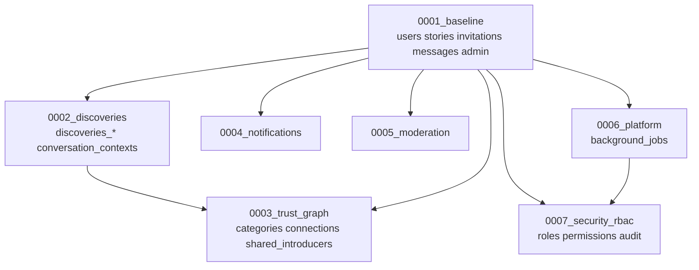

# BuddyIntro Prisma Migration Architecture

**Certified:** 2026-07-14  
**Source of truth:** `prisma/schema.prisma`

## Overview

BuddyIntro uses a **7-migration deterministic chain** generated from `schema.prisma` via `prisma migrate diff`. Every migration depends only on prior migrations. Foreign keys that cross domains are placed in the migration where the referenced table is created.

## Migration order

| # | Migration | Purpose |
|---|-----------|---------|
| 1 | `0001_baseline` | All enums, core identity/social tables, admin_settings seed |
| 2 | `0002_discoveries` | Discoveries feed + conversation_contexts |
| 3 | `0003_trust_graph` | Trust graph, categories, shared introducers + category seed |
| 4 | `0004_notifications` | Notifications, preferences, push, analytics |
| 5 | `0005_moderation` | Verification challenges, blocks, content reports |
| 6 | `0006_platform` | Background jobs |
| 7 | `0007_security_rbac` | RBAC, audit logs, security events + role seed |

## Dependency graph



### Cross-migration foreign keys

These FKs intentionally live in later migrations:

| FK | Migration | Reason |
|----|-----------|--------|
| `stories → introduction_categories` | 0003 | Categories created in 0003 |
| `discoveries_posts → introduction_categories` | 0003 | Categories created in 0003 |
| `messages → discoveries_posts` | 0002 | Discoveries created in 0002 |

## Seed data

| Migration | Seed | NOT NULL handling |
|-----------|------|-------------------|
| 0001 | `admin_settings` id=1 | Explicit `updated_at = CURRENT_TIMESTAMP` |
| 0003 | 15 introduction categories | Explicit `id = gen_random_uuid()` per row |
| 0007 | Roles, permissions, mappings | `gen_random_uuid()` for role/permission ids |

## PostgreSQL extensions

**None required** for PostgreSQL 13+. `gen_random_uuid()` is built into core PostgreSQL.

## Timestamps

| Column | Pattern |
|--------|---------|
| `created_at` | `DEFAULT CURRENT_TIMESTAMP` in migrations |
| `updated_at` (`@updatedAt`) | No DB default — Prisma Client sets on write; seeds provide explicit values |

## Outside Prisma migrations

| Artifact | When to run |
|----------|-------------|
| `prisma/policies.sql` | After `migrate deploy` via `npm run db:rls` |
| Supabase storage policies | Manual / Supabase dashboard |

## Fresh database bootstrap

```bash
npm install
npx prisma migrate deploy
npx prisma generate
npm run build
npm run db:rls   # Supabase RLS only
```

## Certification

**Status:** PASSED (2026-07-14)  
**Log:** `deployment/logs/migration-cert-2026-07-14-1657.log`

Verified on empty database:

1. `prisma migrate reset --force --skip-seed` — all 7 migrations applied
2. `prisma migrate deploy` — no pending migrations
3. `prisma generate` — success
4. `prisma migrate status` — database schema is up to date
5. `prisma migrate diff --from-url <db> --to-schema-datamodel` — zero drift

```bash
# Static audit (no database)
npm test -- tests/migration-audit.test.ts

# Full certification (destructive — cert database only)
MIGRATION_CERT_ALLOW_PRODUCTION=1 node scripts/run-certification.js
# Or: MIGRATION_CERT_DATABASE_URL=postgresql://...cert... node scripts/certify-migrations.js
```

**Connection note:** Supabase `DIRECT_URL` may be unreachable from some networks; certification uses `DATABASE_URL` (session pooler on port 5432) when `MIGRATION_CERT_DATABASE_URL` is unset.

## Adding future migrations

1. Edit `schema.prisma` only — never hand-edit production DB
2. Run `npx prisma migrate dev --name descriptive_name` locally
3. Verify new migration depends only on existing tables
4. Run `node scripts/certify-migrations.js` against a cert database
5. Never use `prisma db push` on production

## Common mistakes to avoid

| Mistake | Consequence |
|---------|-------------|
| Putting baseline tables after feature migrations | `relation "users" does not exist` |
| Seed INSERT omitting NOT NULL columns | Migration fails mid-deploy |
| FK in migration N referencing table from N+1 | Deploy fails |
| Using `git pull` on server instead of `migrate deploy` | Non-deterministic state |
| Partial unique indexes not in schema.prisma | Schema drift |
| Running `db push` on production | Bypasses migration history |
| Deleting archive before cert passes | Lose rollback reference |

## Archive

Previous migrations: `prisma/migrations_archive/pre-rebuild-2026-07-14/`

Safe to delete archive only after production certification succeeds.
