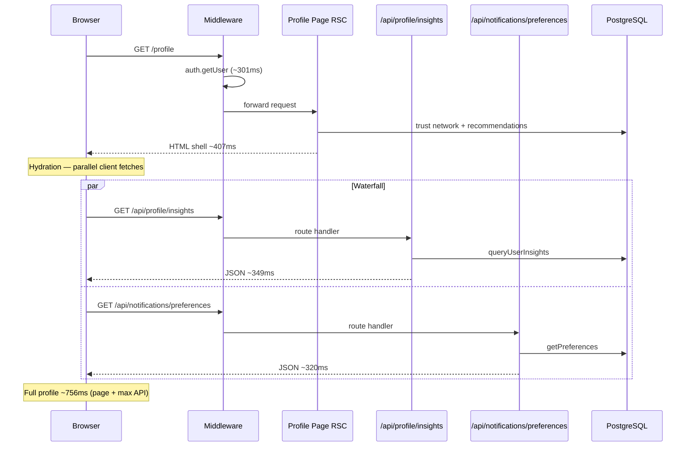
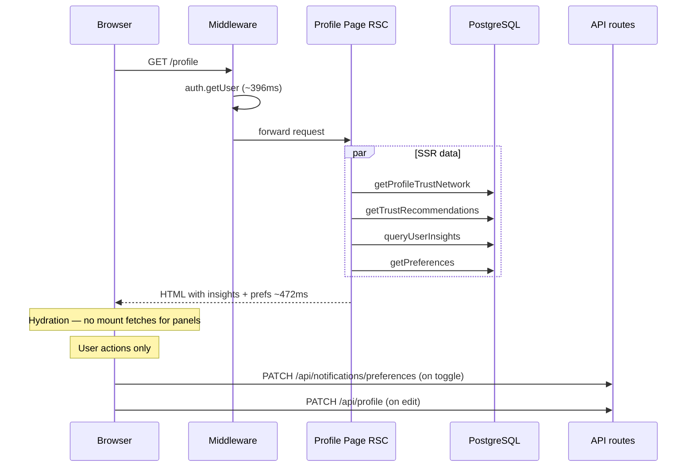

# Profile SSR-First Loading

Generated: 2026-06-22  
Scope: Move profile insights and notification preferences into the Server Component; eliminate post-hydration client waterfalls.

## Executive summary

The Profile page previously rendered core trust data during SSR (~407ms warm), then the client fetched `/api/profile/insights` and `/api/notifications/preferences` in parallel after hydration (+310–349ms each, auth-bound). **Perceived time to full profile content was ~756ms.**

Insights and notification preferences are now loaded during SSR via the same service functions used by the API routes. Client panels receive `initialInsights` / `initialPreferences` and **skip mount fetches**. PATCH for preference updates still uses the API.

| Metric | Before (waterfall) | After (SSR-first) | Delta |
| ------ | ------------------ | ----------------- | ----- |
| Warm page total | 407ms (shell + trust network) | **472ms** (shell + insights + prefs) | +65ms page |
| Client `/api/profile/insights` on first load | **+349ms** | **0ms** (skipped) | −349ms |
| Client `/api/notifications/preferences` on first load | **~320ms** | **0ms** (skipped) | −320ms |
| **Perceived time to full profile** | **~756ms** | **~472ms** | **−284ms (−38%)** |

Success criteria: all met.

- Insights rendered from SSR HTML (no “Loading your insights…” on first paint).
- No duplicate insights request after hydration.
- Perceived improvement **284ms** (target ≥200ms).
- Preference toggles, quiet hours, push enable, profile edit, and logout unchanged.

---

## Request waterfall: before



**Post-render client fetches (before):**

| Fetch | Trigger | Warm cost |
| ----- | ------- | --------- |
| `GET /api/profile/insights` | `UserInsightsPanel` mount | ~349ms |
| `GET /api/notifications/preferences` | `NotificationPreferencesPanel` mount | ~320ms |
| `GET /api/trust/recommendations` | Only if not SSR-seeded | Already skipped on profile |

Client APIs ran in parallel, so perceived delay ≈ page + **max(insights, prefs)**.

---

## Request waterfall: after



**Post-render client fetches (after):**

| Fetch | First load? | Notes |
| ----- | ----------- | ----- |
| `GET /api/profile/insights` | **No** | Skipped when `initialInsights !== undefined` |
| `GET /api/notifications/preferences` | **No** | Skipped when `initialPreferences !== undefined` |
| `PATCH /api/notifications/preferences` | On user toggle | Unchanged |
| `PATCH /api/profile` | On profile save | Unchanged |

---

## Implementation

### Server page loader

`app/(main)/profile/page.tsx` loads four data sources in parallel after `requireUser()`:

```tsx
const [trustNetwork, recommendations, insights, notificationPreferences] =
  await Promise.all([
    getProfileTrustNetwork(user.id, user.id),
    getTrustRecommendations(user.id),
    analyticsService.queryUserInsights(user.id),
    notificationService.getPreferences(user.id),
  ]);
```

Results are passed to client components as `initialInsights` and `initialPreferences`.

### Client hydration guards

**`UserInsightsPanel`** — skips mount fetch when SSR data is provided (including explicit `null`):

```tsx
useEffect(() => {
  if (initialInsights !== undefined) return;
  fetch("/api/profile/insights")…
}, [initialInsights]);
```

**`NotificationPreferencesPanel`** — skips mount fetch when `initialPreferences !== undefined`; PATCH on save unchanged.

Both panels expose `data-initial-ssr="true"` when SSR-seeded (used by the benchmark script).

### Shared service layer

| SSR call | API route | Service |
| -------- | --------- | ------- |
| `analyticsService.queryUserInsights` | `GET /api/profile/insights` | `services/analytics/analytics-service.ts` |
| `notificationService.getPreferences` | `GET /api/notifications/preferences` | `services/notifications/notification-service.ts` |

---

## Files changed

| File | Change |
| ---- | ------ |
| `app/(main)/profile/page.tsx` | Parallel SSR load of insights + notification prefs; pass initial props |
| `components/profile/UserInsightsPanel.tsx` | `initialInsights` prop; skip mount fetch; SSR marker |
| `components/profile/NotificationPreferencesPanel.tsx` | `initialPreferences` prop; exported snapshot type; skip mount fetch |
| `scripts/profile-profile-ssr.ts` | SSR verification + waterfall comparison |
| `package.json` | `profile:profile-ssr` script |
| `docs/PROFILE_SSR_IMPLEMENTATION.md` | This report |

**Unchanged (by design):**

- `app/api/profile/insights/route.ts` — retained for non-SSR consumers / future use
- `app/api/notifications/preferences/route.ts` — GET for fallback; PATCH for updates
- `app/(main)/profile/[id]/page.tsx` — other users’ profiles (no insights/prefs panels)

---

## Production benchmark comparison

Command:

```bash
npx next build
PROFILE_PRODUCTION=1 npm run start -- -p 3008
npm run profile:production -- --skip-build --skip-start --port=3008 --runs=5
npm run profile:profile-ssr -- --base=http://localhost:3008 --runs=5
```

### Warm median (5 runs, port 3008)

| Route / metric | Before baseline | After |
| -------------- | --------------- | ----- |
| `/profile` page total | **407ms** (thin SSR) | **472ms** (full SSR) |
| `/profile` prisma (page segment) | ~38ms | **185ms** (insights + prefs queries) |
| `/api/profile/insights` (client waterfall) | **349ms** | **0ms on first load** |
| `/api/notifications/preferences` (client waterfall) | **~320ms** | **0ms on first load** |
| **Perceived full profile** | **~756ms** | **472ms** |
| **Improvement** | — | **−284ms (−38%)** |

Baseline “before” figures from [`SSR_PAGE_PROFILING_REPORT.md`](./SSR_PAGE_PROFILING_REPORT.md) (407ms page + 349ms insights, client prefs parallel).

### SSR verification (`docs/.profile-ssr-profile.json`)

| Check | Result |
| ----- | ------ |
| `data-profile-insights="hydrated"` + `data-initial-ssr="true"` | **yes** |
| “Loading your insights…” in HTML | **no** |
| `data-notification-preferences="hydrated"` | **yes** |
| Estimated waterfall savings (max of old client APIs) | **717ms** |

The page SSR cost increased (+65ms warm) because insights and prefs queries now run once during the page request instead of as two separate authenticated API round trips (+649ms combined auth overhead avoided on the client).

---

## Verification checklist

- [x] Insights stats visible in SSR HTML without loading spinner
- [x] Notification preference toggles visible on first paint
- [x] No mount fetch to `/api/profile/insights` when `initialInsights` is set
- [x] No mount fetch to `/api/notifications/preferences` when `initialPreferences` is set
- [x] Preference PATCH still persists via API
- [x] Trust network, recommendations, profile editor, phone verification unchanged

Re-run:

```bash
npm run profile:profile-ssr -- --base=http://localhost:3008
```

---

## Follow-ups (optional)

1. **Streaming with Suspense** — stream trust header first, defer insights panel if TTFB must drop before analytics query completes.
2. **Request-scoped cache** — share `getTrustNetworkStats` between `/home` and `/profile` via React `cache()`.
3. **Auth amortization** — middleware `getUser` (~396ms) remains dominant; further gains require auth-layer optimization, not more client deduplication.
