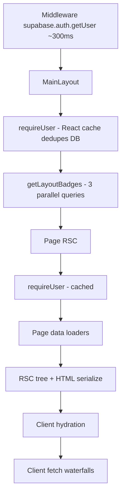

# SSR Page Profiling Report — Home, Discoveries, Profile

Generated: 2026-06-22  
Scope: Production warm benchmarks + static execution trace (no code changes)  
Baseline: `next start`, local PostgreSQL, Phase 1 auth + Phase 2A media cache + message context optimization

## Executive summary

Prisma is no longer the platform bottleneck. **Middleware Supabase session validation (~300–370ms)** accounts for **~75–80%** of warm page TTFB on all three routes. SSR data work is **~25–55ms** (page segment) plus **~20–30ms** layout badges. The larger hidden cost is **client-side waterfalls** after HTML arrives—especially Discoveries feed (`+349ms`) and Profile panels (`+310ms` insights, notifications).

| Page | Warm total (stated) | Auth (middleware) | SSR page segment | Post-hydration API |
| ---- | ------------------- | ----------------- | ---------------- | ------------------ |
| `/home` | **469ms** | ~370ms (79%) | ~49ms | minimal (SSR-heavy) |
| `/discoveries` | **429ms** | ~335ms (78%) | ~27ms | **`/api/discoveries` +349ms** |
| `/profile` | **407ms** | ~301ms (74%) | ~39ms | **insights +349ms, prefs ~320ms** |

**Perceived** Discoveries load ≈ **778ms** (SSR shell + client feed). **Perceived** Profile ≈ **700–900ms** (SSR shell + parallel client fetches).

---

## Methodology

### Data sources

| Source | What it measures |
| ------ | ---------------- |
| Production benchmark (warm median, port 3005) | Client TTFB, total, `x-bench-auth-ms`, page segment via `/api/bench/metrics/{id}` |
| `[AUTH-PROFILE]` / `[PROFILE]` server logs | `requireUser`, `computeTrustRecommendations`, per-segment marks |
| Static trace | Layout → page → service call graph, Prisma query inventory |

### Segment definitions

| Segment | How measured today | Gap |
| ------- | ------------------ | --- |
| **Auth time** | `x-auth-profile-middleware-ms` on HTML response | Accurate |
| **Server component execution** | Page `runWithPerf` total (page-only, excludes layout) | Layout not attributed |
| **Data fetching** | Prisma sum in page stash (over-counts parallel queries) | No per-loader breakdown on pages |
| **Serialization** | Not exposed on HTML routes | **Not instrumented** |
| **RSC rendering** | Included in TTFB − auth − measured SSR | **Estimated** |

Recommended next instrumentation pass (analysis-only note): segment timers on layout, page loaders, and `ReactDOMServer` boundary—**not implemented in this pass**.

---

## Shared architecture



### Layout waterfall (all three pages)

```tsx
// app/(main)/layout.tsx — SEQUENTIAL
const user = await requireUser();           // ① auth (cached after first call)
const badges = await getLayoutBadges(user); // ② blocks children until done
return (... {children} ...);
```

| Step | Queries | Est. warm time |
| ---- | ------- | -------------- |
| `requireUser` | `User.findUnique` (once via `cache()`), `syncLegacyAdminRole` | ~5–15ms |
| `getLayoutBadges` | `getIntroductionExpiryFilter` → `AdminSettings` (cached 60s), `story.count`, `message.count`, `getUnreadNotificationCount` | ~15–25ms |

**Issue:** Layout **fully awaits badges before `{children}` render starts**, so page data fetching cannot overlap with badge queries. This is a **structural waterfall** (~20–30ms fixed cost on every navigation).

**Duplicate `requireUser`:** Layout and page both call `requireUser()`. React `cache()` dedupes `getCurrentUser()` → **one Prisma user row**, but both calls still run (logging, banned check). Not a query duplicate; minor CPU overhead.

---

## Page 1: `/home`

### Warm benchmark decomposition

| Segment | ms | % of 469ms |
| ------- | -- | ---------- |
| Middleware auth | ~370 | 79% |
| Layout badges | ~25 | 5% |
| Page data + RSC (measured segment) | ~49 | 10% |
| Serialize + HTML transfer + gap | ~25 | 6% |

Server log (warm): `computeTrustRecommendations adminSettings=0ms queryConnections=20ms` (cached settings + connections).

### Execution trace

```
MainLayout
  requireUser()
  getLayoutBadges() → story.count, message.count, notifications

HomePage (runWithPerf "/home")
  requireUser()                    // cached
  Promise.all([
    getStoryBarForViewer           // ①
    getMutualTagFeed               // ②
    getTrustNetworkStats           // ③
    getIntroductionSuggestions     // ④
    getTrustRecommendations        // ⑤ cached 5min
  ])
```

### Data-fetch inventory (home page only)

| Loader | Query pattern | Est. queries | Notes |
| ------ | ------------- | ------------ | ----- |
| **① Story bar** | `storyTag.findMany` → `story.findMany` (heavy include) → `filterStoriesByVisibilityGate` (+2 `storyTag`) | **4–5** | Largest payload; tags+users+media URLs |
| **② Feed** | `storyTag` → `story` distinct → `storyTag` co-tag → `post.findMany` ∥ `story.findMany` | **5–6** | **Sequential phases** before final parallel |
| **③ Trust stats** | 4× parallel (`count`,`count`,`findMany`,`findMany`) → `storyTag` distinct → `storyTag` distinct → `userConnection` or **N× `getMutualIntroducers`** | **7–10+** | Slow path loops mutual introducers per tagged user |
| **④ Suggestions** | 2× `storyTag.findMany` + pair logic + bulk shared counts | **3–4** | Overlaps ②③ tag data |
| **⑤ Recommendations** | `AdminSettings` (cached) + `userConnection.findMany` + optional `sharedIntroducerRelationship` | **1–2** | In-memory cache hit after first nav |

**Estimated total home SSR queries:** **~20–25** (parallel overlap; sum of durations ~145–185ms in benchmarks).

### Duplicate / overlapping work

| Duplication | Impact |
| ----------- | ------ |
| **`storyTag.findMany` for “users I tagged”** | Requested by feed, suggestions, stats, story bar | 4× overlapping scans |
| **`story.findMany` with includes** | Story bar + feed + stats recent lists | 3× overlapping |
| **`getAdminSettings`** | Recommendations + expiry filter (layout uses expiry via badges) | Cached after first hit |
| **Trust recommendations panel** | Same loader on home, discoveries, profile if navigated in session | Mitigated by 5min cache |

### Waterfalls

1. **Layout → page** (badges block page start) — ~25ms  
2. **`getMutualTagFeed`** — 3 sequential query phases before posts/stories parallel — ~15–25ms  
3. **`getTrustNetworkStats`** — counts then distinct tags then mutual loop (non-materialized path) — ~20–40ms  
4. **No client API waterfall** — home is fully SSR ✓

### RSC / serialization

Home renders **7 server components** with full story/tag graphs in HTML:

- `TrustNetworkDashboard`, `TrustRecommendationsPanel`, `IntroductionSuggestions`, `StoryBar`, `FeedList`

Large nested props (stories with tags, media proxy URLs) inflate **RSC payload** and serialize time. Estimated **~15–25ms** serialize (not directly measured).

### Suspense streaming candidates

| Component | Priority | Rationale |
| --------- | -------- | --------- |
| `FeedList` + `StoryBar` | **P0** | Below fold; heaviest queries |
| `IntroductionSuggestions` | P1 | Non-critical above fold on mobile |
| `TrustRecommendationsPanel` | P1 | Duplicated across pages; stream or client-hydrate |
| `TrustNetworkDashboard` | P2 | Small stats; keep in initial shell |

---

## Page 2: `/discoveries`

### Warm benchmark decomposition

| Segment | ms | % of 429ms |
| ------- | -- | ---------- |
| Middleware auth | ~335 | 78% |
| Layout badges | ~25 | 6% |
| Page SSR segment | ~27 | 6% |
| Serialize + transfer | ~42 | 10% |
| **Client `/api/discoveries`** | **+349** | **Not in SSR total** |

**Perceived load:** 429ms shell → loading spinner → **+349ms** feed = **~778ms** to interactive feed.

### Execution trace

```
MainLayout (same as above)

DiscoveriesPage
  requireUser()
  Promise.all([
    getAdminSettings()           // cached
    getTrustRecommendations()    // cached
  ])
  resolveDiscoveriesUx(settings) // sync

  RSC shell:
    DiscoveriesComposer (client)
    TrustRecommendationsPanel (client wrapper, SSR props)
    DiscoveriesFeed (client) → useEffect → fetch /api/discoveries
```

### Data-fetch inventory (SSR only)

| Loader | Queries | Est. time |
| ------ | ------- | --------- |
| `getAdminSettings` | 0–1 (cached) | ~0–5ms |
| `getTrustRecommendations` | 0–2 (cached) | ~0–10ms |
| **Page total** | **~1–3** | **~12–27ms** |

Discoveries SSR is **intentionally thin**—the feed is deferred to the client.

### Client waterfall (critical)

```tsx
// DiscoveriesFeed.tsx
useEffect(() => { load(); }, []);  // → GET /api/discoveries (+ auth again ~298ms)
```

| Phase | ms |
| ----- | -- |
| SSR HTML arrives | 429 |
| Hydrate + effect | ~20–40 |
| `/api/discoveries` (warm) | 349 |
| Render posts | ~10 |

This is the **#1 UX bottleneck** for Discoveries despite low SSR Prisma.

### Duplicate work

| Issue | Detail |
| ----- | ------ |
| **Double auth** | Middleware auth on page + middleware auth on `/api/discoveries` |
| **Trust recommendations** | Loaded SSR; same panel on home/profile |
| **Feed data not in SSR** | `/api/discoveries` repeats network graph + trust bulk already optimized (~34ms handler) but adds full auth stack |

### Suspense streaming candidates

| Component | Priority | Rationale |
| --------- | -------- | --------- |
| `DiscoveriesFeed` | **P0** | Move initial feed to RSC async component or `loading.tsx` + server fetch; eliminates 349ms client round-trip |
| `TrustRecommendationsPanel` | P1 | Stream below composer |
| `DiscoveriesComposer` | P2 | Static shell; no data needed |

---

## Page 3: `/profile`

### Warm benchmark decomposition

| Segment | ms | % of 407ms |
| ------- | -- | ---------- |
| Middleware auth | ~301 | 74% |
| Layout badges | ~25 | 6% |
| Page SSR segment | ~39 | 10% |
| Serialize + transfer | ~42 | 10% |
| **Client `/api/profile/insights`** | **+310** | Post-hydration |
| **Client `/api/notifications/preferences`** | **~320** | Post-hydration (parallel) |

### Execution trace

```
MainLayout (same)

ProfilePage
  requireUser()
  Promise.all([
    getProfileTrustNetwork(user.id, user.id)  // self profile
    getTrustRecommendations()
  ])

  RSC:
    Profile header + stats (from trustNetwork)
    TrustNetworkSection (SSR props)
    TrustRecommendationsPanel
    UserInsightsPanel (client → fetch /api/profile/insights)
    PhoneVerificationPanel (SSR props from user)
    ProfileEditor (client)
    NotificationPreferencesPanel (client → fetch /api/notifications/preferences)
    PrivacySettingsPanel
```

### Data-fetch inventory (SSR)

| Loader | Queries | Est. time |
| ------ | ------- | --------- |
| **`getProfileTrustNetwork(self)`** → `getTrustNetworkStats` | Same as home stats: **7–10+** | ~30–50ms |
| **`getTrustRecommendations`** | 0–2 cached | ~0–10ms |

Profile SSR repeats **`getTrustNetworkStats`**—the same heavy stats loader as home dashboard.

### Client waterfalls

| Panel | Endpoint | Warm API time | Blocks UI |
| ----- | -------- | ------------- | --------- |
| `UserInsightsPanel` | `/api/profile/insights` | 310ms | Shows “Loading insights…” |
| `NotificationPreferencesPanel` | `/api/notifications/preferences` | ~320ms | Empty until loaded |
| `ProfileEditor` | none on mount | — | — |

Both client fetches fire **in parallel after hydration**, each paying **full middleware auth**.

### Duplicate work

| Issue | Detail |
| ----- | ------ |
| **`getTrustNetworkStats` on home and profile** | Same counts/stories when user views own profile |
| **Insights API** | 14 parallel analytics counts server-side (~23ms handler) but **~310ms client** due to auth |
| **Trust recommendations** | Third page loading same cached panel |

### Suspense streaming candidates

| Component | Priority | Rationale |
| --------- | -------- | --------- |
| `UserInsightsPanel` | **P0** | Convert to async RSC child or Suspense with server-side `queryUserInsights` |
| `NotificationPreferencesPanel` | **P0** | SSR prefs or stream; avoid client GET |
| `TrustRecommendationsPanel` | P1 | Shared lazy island |
| `TrustNetworkSection` / timeline | P2 | Below fold; stream after header card |

---

## Ranked bottlenecks (all pages)

| Rank | Bottleneck | Pages | Warm cost | Type |
| ---- | ---------- | ----- | --------- | ---- |
| **1** | Middleware `supabase.auth.getUser()` RTT | All | **~300–370ms** | Auth / network |
| **2** | Discoveries client feed fetch | Discoveries | **+349ms perceived** | Client waterfall |
| **3** | Profile client insights + notifications | Profile | **+310–320ms each** | Client waterfall |
| **4** | Layout badges block page data start | All | **~20–30ms** | SSR waterfall |
| **5** | Home duplicate story/tag loaders | Home | **~20–40ms** SSR | Duplicate queries |
| **6** | `getTrustNetworkStats` weight | Home, Profile | **~30–50ms** | Heavy SSR loader |
| **7** | RSC payload size (stories/tags/media) | Home | **~15–25ms** est. | Serialization |
| **8** | `getMutualTagFeed` sequential phases | Home | **~15–25ms** | Query waterfall |
| **9** | Double middleware auth on client API calls | Disc, Profile | **~300ms per fetch** | Auth |

---

## Estimated savings (warm, conservative)

| Fix | Effort | Savings | Pages |
| --- | ------ | ------- | ----- |
| Session JWT local validation / auth cache at edge | High | **200–280ms** | All |
| SSR initial Discoveries feed (remove client round-trip) | Medium | **250–320ms perceived** | Discoveries |
| SSR/stream Profile insights + notification prefs | Medium | **250–300ms perceived** | Profile |
| Layout: stream badges in Suspense boundary | Low | **15–25ms TTFB** | All |
| Unified `loadHomeDashboardData(userId)` | Medium | **20–35ms** SSR | Home |
| Reuse stats snapshot home↔profile (request cache) | Low | **30–50ms** on profile nav | Profile |
| Suspense below-fold on home feed/story bar | Medium | **10–20ms TTFB**; faster FCP | Home |
| Pass layout `user` to pages (eliminate second requireUser) | Low | **~2–5ms** | All |

---

## Implementation plan (no code yet)

### Phase A — Quick wins (1–2 days)

1. **Layout streaming:** Wrap `BottomNav` badge fetch in `<Suspense>`; render `{children}` immediately after cached `requireUser`.
2. **Request-scoped dashboard cache:** `cache()` wrapper for `getTrustNetworkStats(userId)` shared by home + profile.
3. **Discoveries:** Add async server component `DiscoveriesFeedServer` calling `getDiscoveriesFeed` directly; keep client component for pagination only.

### Phase B — Data consolidation (2–3 days)

4. **`loadHomePageData(userId)`:** Single orchestrator; dedupe `storyTag` scans; parallel phases only where dependencies allow.
5. **Profile SSR panels:** Move insights + notification prefs to server components with Suspense fallbacks.
6. **Trust recommendations:** Single shared RSC island loaded once per session or streamed on all three pages.

### Phase C — Auth & perceived performance (3–5 days)

7. **Middleware session optimization:** Short-lived validated session cookie, reduce Supabase RTT (local PG already helps DB side; auth is still remote Supabase).
8. **Static shell + streaming** for home below-fold sections.
9. **Measure serialize** via `PROFILE_PRODUCTION` segment on RSC finish.

---

## Expected page load after fixes

Assumes Phase A+B+C, warm local production, same hardware:

| Page | Today (warm) | After fixes (est.) | Perceived (content-ready) |
| ---- | ------------ | ------------------ | ------------------------- |
| **Home** | 469ms | **180–220ms** TTFB | **220–280ms** (streamed feed/stories) |
| **Discoveries** | 429ms (+349 client) | **160–200ms** TTFB with feed in HTML | **200–250ms** (no spinner) |
| **Profile** | 407ms (+310 client) | **150–190ms** TTFB | **190–240ms** (insights streamed) |

With **auth still at ~300ms** (no session strategy change): floor is **~320–350ms** unless middleware auth is addressed—then floor drops to **~120–180ms**.

### Priority order for maximum user impact

1. Fix middleware auth RTT (platform ceiling)  
2. Eliminate Discoveries client feed waterfall  
3. SSR/stream Profile client panels  
4. Consolidate home data loaders  
5. Layout Suspense + shared caches  

---

## Behavioral risks (when implementing)

| Change | Risk |
| ------ | ---- |
| SSR Discoveries feed | Stale feed until revalidation; match client pagination cursor behavior |
| Shared stats cache | Stale counts after new introduction until cache invalidation |
| Suspense layout badges | Badge counts flash 0 → N; use skeleton not wrong numbers |
| Reduced client fetches | Push notification prefs must still work client-side for PATCH |

---

## Appendix: query map summary

| Page | SSR Prisma executions (est.) | Client API calls | Auth calls per full page view |
| ---- | ---------------------------- | ---------------- | ----------------------------- |
| Home | ~20–25 | 0 | 1 |
| Discoveries | ~3–5 | 1 (`/api/discoveries`) | **2** |
| Profile | ~10–15 | 2 (insights, prefs) | **3** |

---

*Analysis from code trace + `docs/.production-benchmark.json` + `docs/PRODUCTION_BENCHMARK_REPORT.md`. No application code modified in this pass.*
