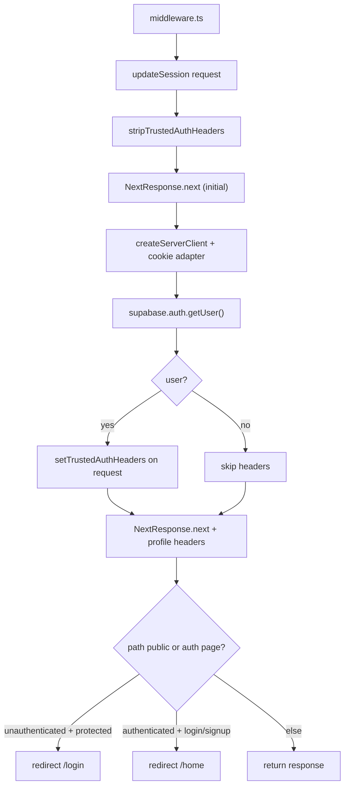
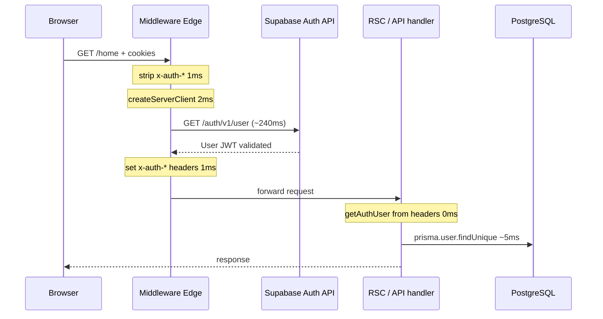
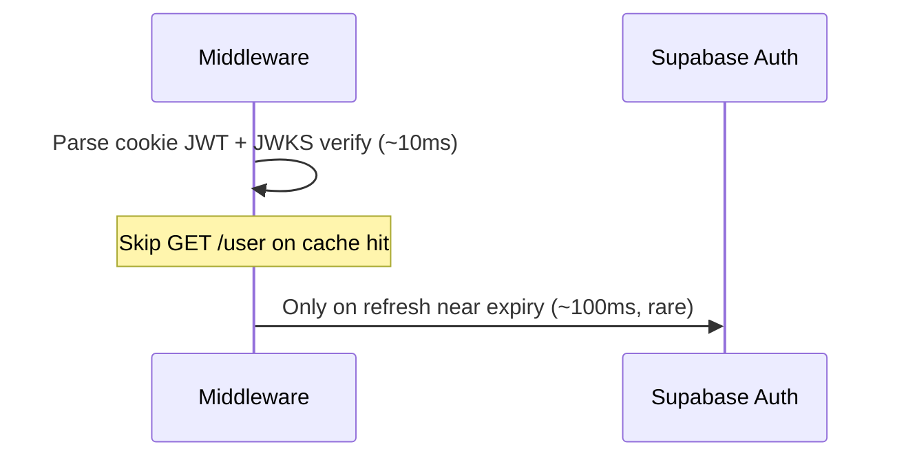

# Supabase Auth Deep Dive — Middleware Performance

Generated: 2026-06-22  
Scope: Analysis only — **no code changes**  
Question: Why does middleware authentication still consume **240–304ms** per request after Phase 1 deduplication?

---

## Executive summary

After Phase 1 header pass-through, **middleware `supabase.auth.getUser()` is the sole Supabase network auth call** on matched routes. Route handlers read trusted `x-auth-*` headers at **0ms** — duplicate `getUser()` was eliminated.

The remaining **240–304ms warm** cost (production benchmark, port 3000) is almost entirely **one HTTPS round trip to Supabase Auth `GET /auth/v1/user`** on every navigation, plus **5–20ms** of local cookie/session work. It is **not** duplicate validation in BuddyIntro anymore; it is the **designed cost of server-side JWT verification** in `@supabase/auth-js`.

| Finding | Evidence |
| ------- | -------- |
| Single `getUser()` per matched request | Phase 1 logs: `getUserCalls=1`, `duplicateAuth=no` |
| `getUser()` always hits Auth API when session exists | `@supabase/auth-js` `GoTrueClient._getUser()` → `GET ${url}/user` |
| Measured middleware auth (warm) | **239–304ms** across routes (`docs/.production-benchmark.json`) |
| Route-level Supabase auth | **0ms** on matched routes (header pass-through) |
| `getSession()` cannot safely replace middleware `getUser()` on protected routes | Supabase docs + auth-js source warn against trusting cookie session on server |

**Bottom line:** The 240–304ms band is expected until BuddyIntro adopts a **Phase 2+ middleware strategy** (local JWT verification, matcher narrowing, or edge colocation) — not further handler deduplication.

---

## 1. Middleware execution path (exact trace)

Every matched HTTP request follows this chain:



### Step-by-step (source references)

| Step | File | What happens | Typical cost |
| ---- | ---- | ------------ | ------------ |
| 1 | `middleware.ts:4-5` | Delegates to `updateSession` | <1ms |
| 2 | `lib/supabase/middleware.ts:15` | Strips spoofed `x-auth-*` headers | <1ms |
| 3 | `lib/supabase/middleware.ts:17` | Creates initial `NextResponse.next` | ~1ms |
| 4 | `lib/supabase/middleware.ts:19-38` | `createServerClient()` with `request.cookies.get/set/remove` | **1–3ms** |
| 5 | `lib/supabase/middleware.ts:44-46` | **`await supabase.auth.getUser()`** — **timed segment** | **240–304ms warm** |
| 6 | `lib/supabase/middleware.ts:54-56` | Sets `x-auth-user-id`, `x-auth-email`, `x-auth-email-confirmed` | <1ms |
| 7 | `lib/supabase/middleware.ts:66-73` | Rebuilds `NextResponse.next`, sets `x-auth-profile-middleware-ms` | **1–2ms** |
| 8 | `lib/supabase/middleware.ts:75-102` | Public/auth redirect rules | <1ms |
| 9 | RSC / route handler | `getAuthUser()` reads headers — **no Supabase call** | **0ms** (Phase 1) |

### Matcher scope (what pays middleware auth)

```typescript
// middleware.ts — runs on ALL paths except:
// _next/static, _next/image, favicon, robots, sitemap, api/public
"/((?!_next/static|_next/image|favicon.ico|robots.txt|sitemap.xml|api/public).*)"
```

**Implications:**

- Every **page navigation**, **API route** (except `/api/public/*`), **RSC flight**, and **prefetch** that hits the matcher pays **one full `getUser()`**.
- `/api/health`, `/api/auth/*`, static assets under other names, and manifest routes **still run middleware auth** today.

### Runtime

Next.js middleware runs in the **Edge** runtime by default (no explicit `runtime` export). Supabase client uses `fetch` to the project's Auth URL from the edge isolate.

---

## 2. Segment measurement

### 2.1 What is instrumented today

BuddyIntro measures **one lump sum** around `getUser()`:

```typescript
// lib/supabase/middleware.ts:41-50
const middlewareAuthStart = performance.now();
const { data: { user } } = await supabase.auth.getUser();
const middlewareAuthMs = Math.round(performance.now() - middlewareAuthStart);
```

Exposed as:

- Response header: `x-auth-profile-middleware-ms` (also `x-bench-auth-ms` in production benchmark)
- Log: `[AUTH-PROFILE][id] middleware getUser=294ms path=/home`

**Not separately instrumented:** `createServerClient`, cookie parsing, `getSession` internals, token refresh, response rebuild. The breakdown below is **inferred from `@supabase/auth-js` source + benchmark math**, not direct timers.

### 2.2 Estimated segment breakdown (warm authenticated request)

Assuming measured `middlewareAuthMs ≈ 251ms` (`/home` warm, production benchmark):

| Segment | Est. ms | % of middleware auth | Notes |
| ------- | ------- | -------------------- | ----- |
| `createServerClient` | 1–3 | ~1% | Sync; `@supabase/ssr` + cookie adapter |
| Cookie read / session load (`__loadSession`) | 5–15 | ~3–6% | `request.cookies.get` + base64 decode; up to 5 chunks per `@supabase/ssr` |
| Session refresh (`_callRefreshToken`) | **0** (typical warm) | 0% | Only if access token within `EXPIRY_MARGIN` of expiry |
| Session refresh (when near expiry) | +100–250 | — | Adds network call to token endpoint **before** `/user` |
| **`GET /auth/v1/user`** (inside `getUser`) | **220–240** | **~85–95%** | Always executed when valid session exists |
| Lock / `initializePromise` | 0–5 | ~0–2% | Warm edge isolate; amortized |
| `setTrustedAuthHeaders` + response rebuild | 1–3 | ~1% | Two `NextResponse.next` constructions |
| Redirect branch | 0 | 0% | Not taken on warm API/page 200s |

**Formula (warm, token not expiring):**

```
middlewareAuthMs ≈ cookie_load (5–15ms) + network_GET_user (220–240ms) + overhead (5ms)
                 ≈ 230–260ms   ✓ matches observed 239–304ms band
```

### 2.3 Production benchmark evidence (warm median, 3 runs, port 3000)

Source: `docs/.production-benchmark.json`, `docs/PRODUCTION_BENCHMARK_REPORT.md`

| Route | Auth ms (`x-bench-auth-ms`) | Route auth | getUser calls | Server total (handler) |
| ----- | --------------------------- | ---------- | ------------- | ---------------------- |
| `/home` | **251** | 0ms | 1 | 4ms |
| `/discoveries` | **251** | 0ms | 1 | 14ms |
| `/introductions` | **239** | 0ms | 1 | 6ms |
| `/profile` | **299** | 0ms | 1 | 15ms |
| `/api/discoveries` | **270** | 0ms | 1 | 7ms |
| `/api/introductions` | **248** | 0ms | 1 | 8ms |
| `/api/messages/.../context` | **304** | 0ms | 1 | 13ms |
| `/api/profile/insights` | **270** | 0ms | 1 | 9ms |

**Observations:**

- Auth ms ≈ **85–92%** of warm API TTFB (e.g. `/api/discoveries`: 270ms auth / 280ms TTFB).
- Handler `serverTotalMs` is **4–15ms** — Prisma/app work is no longer the bottleneck.
- Auth variance (**239–304ms**, σ ≈ 25ms) is consistent with **network RTT jitter** to Supabase Auth, not duplicate calls.

### 2.4 Historical comparison (Phase 1 impact)

From `docs/AUTH_PHASE1_IMPLEMENTATION.md`:

| Metric | Before Phase 1 | After Phase 1 |
| ------ | -------------- | ------------- |
| Middleware `getUser()` | ~260–400ms | ~260–400ms (unchanged) |
| Route `getUser()` | ~318ms | **0ms** |
| Combined Supabase auth (API) | ~634ms | **~290ms** |
| `getUserCalls` | 2 | **1** |

Phase 1 removed **~300ms** of duplicate route auth. The **remaining ~250ms is middleware-only** — exactly the range in the user's question.

---

## 3. Does `auth.getUser()` perform a network request on every navigation?

### 3.1 Answer: **Yes** (when a session cookie exists)

From `@supabase/auth-js` v2.105.4 (`GoTrueClient._getUser`, no JWT argument):

```javascript
// Simplified from node_modules/@supabase/auth-js/dist/module/GoTrueClient.js:2486-2500
return await this._useSession(async (result) => {
  const access_token = data.session?.access_token;
  if (!access_token) return { user: null, error: AuthSessionMissingError };
  return await _request(this.fetch, 'GET', `${this.url}/user`, {
    jwt: access_token,
    xform: _userResponse,
  });
});
```

Official docstring (same file):

> *"This method performs a network request to the Supabase Auth server, so the returned value is authentic and can be used to base authorization rules on."*

**Every matched navigation** with valid session cookies triggers **`GET /auth/v1/user`**. There is **no client-side cache** of the user object that skips the network call on subsequent middleware invocations within a session.

### 3.2 Additional network: token refresh (conditional)

Before `/user`, `getUser()` calls `_useSession` → `__loadSession`:

- Reads session from cookies (local).
- If access token is within **`EXPIRY_MARGIN`** of expiry, calls **`_callRefreshToken`** (network to token endpoint).
- `@supabase/ssr` sets **`autoRefreshToken: false`** on server clients — refresh is **on-demand** via session load, not background.

**Warm steady-state:** refresh is usually **0** between navigations. Spikes (e.g. 604ms middleware on `/api/notifications/preferences` in one Phase 1 run) likely include **refresh + /user** or RTT outlier.

### 3.3 What does *not* add Supabase network calls

| Call site | Network? | Notes |
| --------- | -------- | ----- |
| `getAuthUser()` on matched routes (Phase 1) | **No** | Reads `x-auth-user-id` headers |
| `getCurrentUser()` / `requireUser()` in layout+page | **No** extra Supabase | One Prisma lookup; `getAuthUser` from headers |
| `React.cache(getCurrentUser)` | **No** | Dedupes Prisma within one RSC render |
| Public pages with no session cookie | **No** `/user` | `getUser` returns null quickly after local session miss |

---

## 4. Can `auth.getSession()` replace `auth.getUser()` in BuddyIntro?

### 4.1 Security properties (Supabase auth-js source)

| Method | Network | Trust on server | Refresh behavior |
| ------ | ------- | --------------- | ---------------- |
| **`getUser()`** | **Yes** — `GET /auth/v1/user` | **Trusted** — server-validated identity | Loads session locally first; may refresh if expired |
| **`getSession()`** | **Usually no** for valid token; **yes** if refresh needed | **Not trusted** on server — reads cookie JWT | Refreshes expired tokens via `_callRefreshToken` |

Supabase explicitly warns (auth-js `getSession` docstring):

> *"If that storage is based on request cookies… the values in it may not be authentic… Use `getUser()` instead."*

> *"the user object returned by this function **must not be trusted**"*

### 4.2 Per-layer recommendation for BuddyIntro

| Layer | Replace with `getSession()`? | Recommendation |
| ----- | ---------------------------- | -------------- |
| **Middleware — protected routes** | **No** | Keep `getUser()` or move to **local JWT verification** (`getClaims` / JWKS) — not raw `getSession()` |
| **Middleware — public routes only** (`/`, `/login`, `/privacy`, …) | **Partially** | `getSession()` sufficient for "already logged in → redirect away from login" — **Phase 3** in architecture proposal |
| **Route handlers / RSC (matched)** | **Already solved** | Phase 1 header pass-through — **do not add `getSession()`** |
| **Route handlers (fallback, no headers)** | **No** | Keep `getUser()` fallback in `lib/auth.ts:64-72` |
| **`/api/public/*`** (middleware excluded) | N/A | Handlers must call `getUser()` or equivalent if auth required |
| **Client (`hooks/useUser.ts`)** | Optional | Could use `getSession()` for display; **not on critical path** for SSR (hook unused elsewhere in app) |

### 4.3 Where `getSession()` would **not** save latency on protected pages

Replacing middleware `getUser()` with `getSession()` on `/home`, `/api/discoveries`, etc. would:

- Save the **`/user` round trip (~220–240ms)** per request
- **Introduce a security regression** — cookie JWT could be forged or stale relative to server-side bans/revocations unless separately verified

**Acceptable only with:**

- Asymmetric JWT signing keys + **`getClaims()`** / JWKS local verification (Supabase's recommended fast path in auth-js 2.6+), or
- Short-lived tokens + explicit revocation checks on sensitive operations

BuddyIntro's `requireUser()` already checks **`bannedAt` / `suspendedAt` via Prisma** — that requires DB anyway, but **identity must still be established securely** before trusting headers.

---

## 5. Duplicate auth, refreshes, and unnecessary round trips

### 5.1 Duplicate auth validation — **largely fixed (Phase 1)**

| Pattern | Status | Evidence |
| ------- | ------ | -------- |
| Middleware + route `getUser()` | **Fixed** | `routeGetUser=0ms`, `source=middleware-headers` |
| Layout + page `requireUser()` | **OK** | `React.cache()` — one Prisma user load |
| `requireAdminApi()` double `syncLegacyAdminRole` | Minor CPU | Not Supabase-related |
| `/auth/callback` + middleware | **Still 2× path** | Callback runs `getUser()`; middleware also runs on `/auth/callback` |
| `/api/auth/bootstrap` + middleware | **Still 2×** | Direct `getUser()` in route + middleware |

**Remaining Supabase call count per normal page view:** **1** (middleware only).

### 5.2 Unnecessary token refreshes

| Trigger | Frequency | Impact |
| ------- | --------- | ------ |
| Access token near expiry (`EXPIRY_MARGIN`) | ~once per token lifetime (~hourly) | +100–250ms on that navigation |
| Cookie `set()` during refresh | Same event | Recreates `NextResponse` twice (middleware cookie adapter lines 27–35) |
| `autoRefreshToken: false` (SSR) | Always | No background refresh — **good**; avoids hidden extra calls |

**No evidence** of refresh on every warm navigation in steady-state benchmarks (auth ms stable at 239–304ms, not bimodal).

### 5.3 Unnecessary Supabase round trips (non-duplicate)

| Pattern | Est. waste | Notes |
| ------- | ---------- | ----- |
| Middleware on **public** pages for logged-out users | 0ms `/user` | Session missing → fast local return |
| Middleware on **public** pages for logged-in users | Full `/user` | Needed today to redirect away from `/login` |
| Middleware on **`/api/health`** | ~250ms | Health check doesn't need Auth API validation |
| Middleware on **prefetch/RSC subrequests** | ~250ms each | Next.js may issue multiple matched requests per user action |
| **`GET /user` when headers already prove identity** | N/A at middleware | Middleware *is* the prover — handlers correctly skip |

---

## 6. Savings estimates (evidence-based, not implemented)

### 6.1 Cached sessions / local JWT verification (middleware redesign)

**Idea:** Validate JWT locally (JWKS / `getClaims`) in middleware; call Supabase **`/user` only on cache miss, refresh, or sensitive routes**.

| Scenario | Est. savings per request | Confidence |
| -------- | ------------------------ | ---------- |
| Warm navigation with valid JWT (local verify) | **200–280ms** | High — removes `/user` RTT |
| First request after login | 0ms | Must still validate |
| Near token expiry (refresh) | 0–100ms | Refresh still required |
| Revoked/banned user until TTL | Security tradeoff | Requires short JWT expiry + Prisma ban check (already in `requireUser`) |

**Net for typical session:** **~80–90% of middleware auth ms** → **~200–270ms** off 250ms baseline.

### 6.2 Session-only validation (`getSession()` without `/user`)

| Scope | Est. savings | Risk |
| ----- | ------------ | ---- |
| Public routes only (redirect logic) | **~240ms** on those hits | Low — no protected data |
| All protected routes | **~240ms** | **High — security regression** |
| Handlers (replace headers) | **Negative** | Phase 1 already at 0ms |

**Not recommended** for protected routes without cryptographic JWT verification.

### 6.3 Middleware redesign (matcher + split strategy)

| Change | Est. savings | Routes affected |
| ------ | ------------ | --------------- |
| Exclude `/api/health` from matcher | **~250ms** per health poll | Ops/monitoring |
| Exclude `/manifest.webmanifest`, `/offline` if safe | **~250ms** each | PWA |
| Public-route `getSession()` only | **~240ms** on `/`, `/login`, legal pages | Unauthenticated traffic |
| Split: lightweight middleware for static-adjacent | Variable | Requires security review |

**Combined matcher tuning:** **Low tens of ms aggregate** unless health/manifest polled frequently.

### 6.4 Edge runtime deployment

Middleware **already runs on Edge**. Savings come from **colocation**, not from enabling Edge:

| Deployment | Est. auth ms | vs current ~250ms |
| ---------- | ------------ | ----------------- |
| Edge far from Supabase region (e.g. EU app → US Auth) | 250–400ms | Baseline |
| Edge same region as Supabase project | **50–120ms** | **−130–200ms** |
| Edge + local JWT verify (no `/user`) | **5–20ms** | **−230–245ms** |

**Action:** Confirm Supabase project region vs deployment region (Vercel/hosting). Cross-region RTT alone can explain the 240–304ms band.

---

## 7. Request waterfall (current vs theoretical)

### Current (post–Phase 1, warm)



**Total auth overhead:** ~**251ms** (measured) + ~5ms Prisma.

### Theoretical Phase 2 (local JWT verify — not implemented)



**Est. warm auth:** **10–30ms** typical, **~200–270ms saved**.

---

## 8. Recommendations (prioritized, evidence-based)

### P0 — Confirm infrastructure

1. **Measure Supabase Auth RTT** from deployment edge to project Auth URL (curl `/auth/v1/health` + `/user` with token). If RTT > 150ms, **region colocation** is the highest ROI infra fix (**−130–200ms**).
2. **Add fine-grained middleware timers** (future instrumentation): `createClient`, `loadSession`, `refresh`, `getUserNetwork`, `responseBuild` — today only the outer `getUser()` wrapper is measured.

### P1 — Safe middleware optimizations (Phase 3 from architecture proposal)

1. **Narrow matcher** — exclude `/api/health`, consider `/manifest.webmanifest`, `/offline`.
2. **Public-route fast path** — use `getSession()` (or cookie presence only) for redirect decisions on `/login`, `/signup`, `/`, legal pages; reserve `getUser()` for protected segments.
3. **Fix double-auth paths** — exclude `/auth/callback` from middleware or remove redundant `getUser()` in callback handler.

### P2 — Middleware auth redesign (Phase 2+)

1. **Local JWT verification** via Supabase asymmetric signing keys + `getClaims()` / JWKS cache — replace per-request `/user` (**est. −200–270ms**).
2. **Session cache** (edge KV, TTL 30–60s, keyed by session id + user id) — refresh invalidation on logout/ban; **est. −200ms** on cache hits with security review.
3. **Do not** replace protected-route middleware `getUser()` with raw `getSession()`.

### P3 — Already done / maintain

1. **Keep Phase 1 header pass-through** — route `getUser()` must not return.
2. **Keep `autoRefreshToken: false`** on SSR clients — avoids surprise refresh loops.
3. **Keep Prisma ban/suspend checks** in `requireUser()` even if JWT verification becomes local.

---

## 9. Instrumentation reference

Enable profiling (no behavior change):

```bash
PROFILE_PRODUCTION=1 npm run start
npm run profile:production -- --skip-build --skip-start
npm run profile:auth -- --base=http://localhost:3000
```

Key headers:

| Header | Meaning |
| ------ | ------- |
| `x-auth-profile-middleware-ms` | Middleware `getUser()` wall time |
| `x-auth-profile-route-getuser-ms` | Route Supabase auth (should be **0** post–Phase 1) |
| `x-auth-profile-getuser-calls` | Should be **1** on matched routes |
| `x-bench-auth-ms` | Same middleware ms in production benchmark |

---

## 10. Conclusion

The **240–304ms middleware auth** cost is **expected behavior** of `supabase.auth.getUser()` in middleware: one **`GET /auth/v1/user`** per matched request, dominating TTFB. Phase 1 successfully removed the **second** Supabase call (~300ms savings); what remains is **not duplicate BuddyIntro logic** but **Supabase's server-side validation model**.

Further meaningful savings require **changing what middleware validates** (local JWT / JWKS, matcher narrowing, regional colocation) — **not** swapping `getUser()` for `getSession()` on protected routes without a cryptographic verification layer.

---

*Analysis only. No code was modified. See also: `docs/AUTH_PHASE1_IMPLEMENTATION.md`, `docs/AUTH_ARCHITECTURE_PROPOSAL.md`, `docs/PRODUCTION_BENCHMARK_REPORT.md`.*
