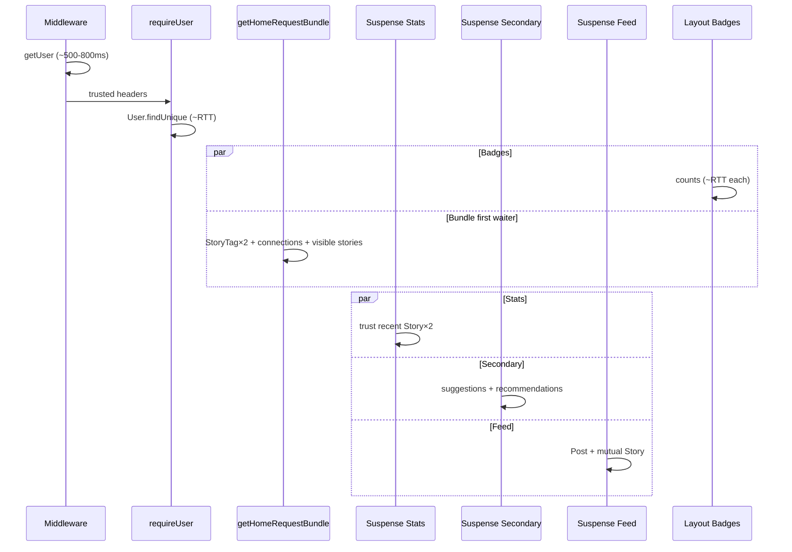

# Server Timeline

**Sprint:** Performance Reset (READ-ONLY)  
**Generated:** 2026-07-31

---

## Evidence sources

| Capture | Status | Use |
| --- | --- | --- |
| Live 2026-07-31 `/home` `a96991ce` | **500** (schema drift) | Middleware + compile + auth path only |
| Live 2026-07-31 `/` browser | **200** | Public page server+browser |
| Historical `/home` `2afc354d` (2026-07-26) | **200** cold | Full Prisma waterfall |
| Sprint 3 warm `/home` | **200** | Steady-state TTFB reference (2,344 ms) |

---

## Waterfall A — Live `/home` 500 (request `a96991ce`)

```
0 ms     HTTP request arrives
~0–573   Middleware updateSession
           createClient=4ms
           loadSession=13ms
           getUserNetwork=555ms   ← Supabase Auth RTT
           total middlewareGetUser=573ms
~573     Begin RSC / MainLayout requireUser
~573     getAuthUser from middleware-headers = 0ms (Sprint 2 OK)
~573     prisma.user.findUnique → P2022 preferred_language missing
~573–4.3s  Next.js compile /[locale]/home (2079 modules) ≈ 4,300ms
         AUTH route-summary: other=6,042ms, total=6,615ms
~12.5s   GET /home 500 (client observed TTFB 13,519ms)
```

| Stage | ms | Evidence |
| --- | --- | --- |
| Middleware Auth `getUser` | **573** | AUTH-PROFILE |
| Route `getUser` | **0** | headers reuse |
| Prisma user load | **fails** | schema drift |
| Dev compile (first hit) | **~4,300** | Next log |
| Remaining “other” | **~6,042** | AUTH-PROFILE (compile + error path) |
| Client TTFB | **13,519** | http capture |

**Cannot measure** Story / recommendation / streaming stages until schema is aligned.

---

## Waterfall B — Historical successful cold `/home` (`2afc354d`)

| Stage | Approx wall | Notes |
| --- | --- | --- |
| Middleware getUser | 795 ms | AUTH-PROFILE |
| Auth Prisma User | 2,538–6,639 ms | cold / contended |
| Compile + early work | ~29 s gap in logs | Dev cold compile dominates TTFB 43,395 ms |
| Parallel cluster (~T+29s) | AdminSettings, StoryTag×2, badges, Story.count | ~600–4,600 ms each |
| Parallel Story/graph (~T+30s) | Trust stories, visible stories, Post, connections | ~624–3,651 ms |
| Mutual authors Story | **4,898 ms** | Slowest single query |
| Client TTFB / total | **43,395 / 52,696 ms** | Cold — **not** production baseline |

---

## Waterfall C — Steady-state warm `/home` (Sprint 3 measured)

| Metric | Value | Source |
| --- | --- | --- |
| TTFB | **2,344 ms** | `HOME_PERFORMANCE_DIFF.md` |
| Total | **9,246 ms** | same |
| Prior Sprint 2 warm TTFB | 6,103 ms | Auth report |

Estimated stage split for warm `/home` (model, not re-instrumented this session):

| Stage | Estimate | Basis |
| --- | --- | --- |
| Middleware Auth | 400–800 ms | Live 573–1033 ms; hist 471–795 ms |
| Session User Prisma | ~300–600 ms | 1× pooler RTT after headers |
| Graph + StoryTag context | ~600–1,200 ms | 2 tags often parallel; one slow |
| Story / feed / trust / recommendations | ~1,500–4,000 ms wall | longest of parallel Suspense arms |
| Layout badges | overlaps Suspense | Message/Notification/Story counts |
| RSC serialize / stream | 100–500 ms | not separately timed |
| **TTFB (first byte / shell)** | **~2.3 s warm** | measured Sprint 3 |
| **Full document (dev)** | often higher | streams fill after TTFB |

---

## Waterfall D — Live landing `/` (browser Navigation Timing)

| Stage | ms |
| --- | --- |
| TTFB | 2,570 |
| FCP | 2,712 |
| DOMContentLoaded | 2,688 |
| load | 2,916 |
| DNS / TCP / TLS (localhost) | 0 / 1 / 0 |

Landing still pays middleware `getUser` RTT even though the page is public.

---

## Parallel vs sequential (authenticated `/home`)



**Implication:** Suspense hides some latency from *shell* TTFB, but user-perceived “home is ready” waits on the slowest stream arm (often mutual-author Story or recommendations graph).

---

## Stage accounting summary

| Stage | Proven? | Dominant cost |
| --- | --- | --- |
| Middleware | Yes (live) | Supabase Auth network ~500–1000 ms |
| Auth User DB | Yes (hist) / blocked live | Pooler RTT |
| Graph / Story / Recs | Yes (hist) | Pooler RTT × query count / critical path |
| React render | Partial | Secondary to DB wait |
| Streaming | Architectural | Improves shell, not full readiness |
| Dev compile | Yes (live) | Multi-second first navigation only |
