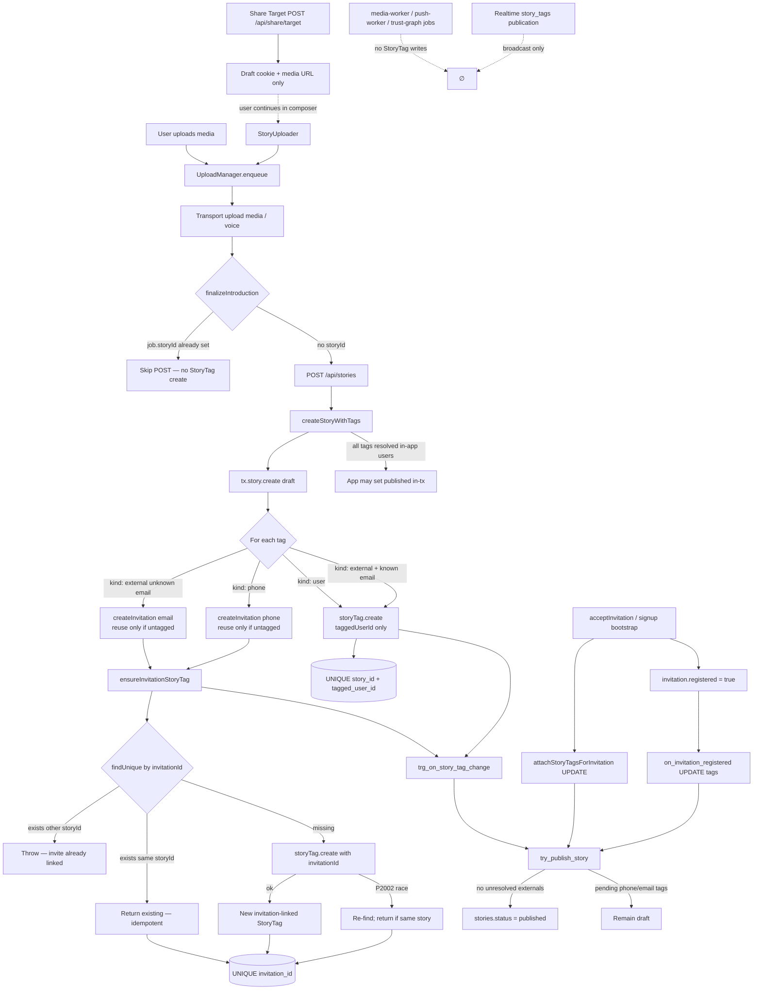

# StoryTag Architecture Certification

**Mode:** Production certification (architectural verification)  
**Date:** 2026-08-06  
**Scope:** Every repository path capable of creating or modifying `story_tags`  
**Related hotfix:** Idempotent `ensureInvitationStoryTag` + untagged-only invitation reuse

---

## Certification verdict

| Question | Answer |
|----------|--------|
| Is invitation-linked StoryTag creation a single idempotent pathway? | **YES** — `ensureInvitationStoryTag` only |
| Does the database enforce one invitation → one StoryTag? | **YES** — `UNIQUE (invitation_id)` |
| Can workers, realtime, Share Target, or accept flows create invite StoryTags? | **NO** |
| Is the architecture production-safe for StoryTag uniqueness? | **YES — CERTIFIED** |

---

## 1. Complete StoryTag creation inventory

### 1.1 Actual `CREATE` / `INSERT` occurrences

Exhaustive search covered: `storyTag.create`, `createMany`, `upsert`, `connectOrCreate`, nested Prisma writes (`tags: { create }`), raw SQL `INSERT INTO story_tags`, migrations, seeds, simulation, tests, workers, admin APIs.

| # | File | Function / site | Purpose | Prod runtime? | Invitation-linked? | Ordinary (no invitation)? |
|---|------|-----------------|---------|---------------|--------------------|---------------------------|
| C1 | `services/stories.ts` | `ensureInvitationStoryTag` | Idempotent attach of StoryTag to invitation + external email/phone | **YES** | **YES** (only path) | No |
| C2 | `services/stories.ts` | `createStoryWithTags` — `tag.kind === "user"` | Tag an existing BuddyIntro user on a new story | **YES** | No (`invitationId` omitted) | **YES** |
| C3 | `services/stories.ts` | `createStoryWithTags` — external email when user already exists | Resolve email to known user; create user tag | **YES** | No | **YES** |
| C4 | `prisma/seed-demo-users.ts` | `ensureIntroStory` / `ensureMutualStory` | Demo seed data | **NO** (CLI seed) | No | **YES** |
| C5 | `lib/simulation/seed.ts` | simulation story batch | Load-test / graph simulation | **NO** (offline sim) | No | **YES** (`createMany`, no `invitationId`) |

### 1.2 Confirmed absent

| Pattern | Result |
|---------|--------|
| `storyTag.upsert` | **None** |
| `storyTag.connectOrCreate` | **None** |
| Nested `story.create({ data: { tags: { create: … } } })` | **None** |
| Raw SQL `INSERT INTO story_tags` / `INSERT INTO public.story_tags` | **None** in app, workers, migrations (create-table only in baseline) |
| Admin API StoryTag create | **None** |
| Test utilities creating StoryTags | **None** |
| `scripts/media-worker.ts` / push worker / trust-graph jobs | **None** |
| Share Target / share draft routes | **None** (media upload + cookie only) |
| DB triggers inserting into `story_tags` | **None** (UPDATE / publish only) |

### 1.3 Modify-only paths (not creation)

| File | Function | Operation | Prod? | Notes |
|------|----------|-----------|-------|-------|
| `services/invites.ts` | `attachStoryTagsForInvitation` | `storyTag.update` | YES | Sets `taggedUserId` on accept; never inserts |
| `prisma/policies*.sql` / `20260803_phone_aware_story_publish` | `on_invitation_registered` | `UPDATE story_tags` | YES (DB) | Same resolution as app attach |
| `prisma/policies*.sql` | `try_publish_story` | `UPDATE stories` | YES (DB) | Reads tags; publishes story |
| `prisma/policies*.sql` | `on_story_tag_change` | calls `try_publish_story` | YES (DB) | No StoryTag insert |
| `components/stories/StoryPlayer.tsx` | delete story | `DELETE /api/stories/:id` | YES | Cascade deletes tags via FK |

### 1.4 Read-only production consumers

These only `findMany` / `findFirst` / `count` StoryTags — no writes:

`services/home-dashboard.ts`, `services/feed.ts`, `services/trust-network.ts`, `services/trust-abuse.ts`, `services/introduction-suggestions.ts`, `services/introduction-graph-builder.ts`, `services/analytics/analytics-service.ts`, `services/consent.ts`, `lib/story-visibility.ts`, `lib/shared-introducers.ts`, `lib/introduction-graph.ts`, `lib/conversation-graph-fast.ts`, plus profiling/audit scripts.

### 1.5 Single invitation-linked pathway (proof)

**Only C1 sets `invitationId` on insert.**

Call chain:

```
createStoryWithTags
  → createInvitation(..., tx)          // mint OR reuse pending with storyTags: { none: {} }
  → ensureInvitationStoryTag(tx, …)    // findUnique(invitationId) | create | P2002 race recovery
```

No other production function passes `invitationId` into `storyTag.create` / `createMany`.

---

## 2. Production call graph

### 2.1 Mermaid — every production branch to StoryTag creation / publish



### 2.2 Branch summary

| Branch | Creates invitation StoryTag? | Creates ordinary StoryTag? | Outcome |
|--------|------------------------------|----------------------------|---------|
| Upload → API → user/known-email tag | No | Yes | Ordinary tag |
| Upload → API → phone / unknown email | **Yes via ensure\*** | No | Invitation-linked |
| Upload retry with `job.storyId` | No | No | No-op |
| Share Target alone | No | No | Storage + cookie |
| Accept / associate siblings | No | No | UPDATE only |
| Workers / realtime | No | No | None |

---

## 3. Database constraint verification

### 3.1 Prisma schema (`StoryTag`)

```prisma
model StoryTag {
  invitationId        String? @unique @map("invitation_id") @db.Uuid
  // …
  @@unique([storyId, taggedUserId])
  @@unique([storyId, taggedExternalEmail])
  @@unique([storyId, taggedExternalPhone])
}
```

### 3.2 Unique indexes (baseline migration)

| Index | Enforces |
|-------|----------|
| `story_tags_invitation_id_key` | **One StoryTag per invitation** (NULL invitation_id allowed many times — Postgres UNIQUE semantics) |
| `story_tags_story_id_tagged_user_id_key` | One user tag per story |
| `story_tags_story_id_tagged_external_email_key` | One external email tag per story |
| `story_tags_story_id_tagged_external_phone_key` | One external phone tag per story |

### 3.3 Foreign keys

| FK | On delete |
|----|-----------|
| `story_tags_story_id_fkey` → `stories.id` | **CASCADE** |
| `story_tags_tagged_user_id_fkey` → `users.id` | SET NULL |
| `story_tags_invitation_id_fkey` → `invitations.id` | SET NULL |

### 3.4 Relevant triggers

| Trigger | Event | StoryTag insert? | Effect |
|---------|-------|------------------|--------|
| `trg_on_invitation_registered` | `UPDATE invitations` when `registered` flips true | **No** | `UPDATE story_tags` set `tagged_user_id`; then `try_publish_story` |
| `trg_on_story_tag_change` | `INSERT OR UPDATE story_tags` | **No** (reacts to inserts; does not insert) | `try_publish_story` |
| `trg_on_invitation_created` | `INSERT invitations` | **No** | Increments `users.invites_sent` |

### 3.5 One invitation → one StoryTag

Confirmed by:

1. Unique index `story_tags_invitation_id_key`  
2. Application: `createInvitation` reuses pending invites **only** when `storyTags: { none: {} }` (forces a new invitation for a second story)  
3. Application: `ensureInvitationStoryTag` refuses to attach the same invitation to a different `storyId`

---

## 4. Why duplicate invitation-linked StoryTags cannot occur

| Layer | Mechanism |
|-------|-----------|
| Invitation minting | Pending invite reused only if it has **zero** StoryTags → second introduction gets a **new** invitation row |
| App create | `ensureInvitationStoryTag` short-circuits on existing `invitationId` for the same story; errors if linked to another story |
| Race | Concurrent creates hit `P2002` on `invitation_id`; handler re-reads and returns the winner if same story |
| Database | Unique index rejects a second row for the same `invitation_id` even if app logic is bypassed |
| Accept / triggers | UPDATE existing rows only — cannot insert a second tag for the invitation |
| Upload Manager | After first successful finalize, `job.storyId` prevents a second `POST /api/stories` for that job |
| Workers / realtime / Share Target | No insert path |

Therefore a single invitation cannot own two StoryTag rows under production load.

---

## 5. Race-condition matrix

| Scenario | Behaviour | Duplicate invite StoryTag? |
|----------|-----------|----------------------------|
| Double-click publish | Two POSTs possible before `job.storyId` set; each may create a **new story** + **new invitation** (untagged reuse rule) | **No** (different invitations) |
| Multiple browser tabs | Same as above per tab/job | **No** |
| Refresh mid-upload | Job state restored from IDB; finalize skips if `storyId` present | **No** |
| Network retry after 201 lost | Client may retry without `storyId`; second POST creates **new** story/invite pair, not second tag on same invite | **No** for same invitation |
| Background upload retry | `job.storyId` guard skips re-POST | **No** |
| Share Target retry | Re-uploads media / cookie only; StoryTag only if user later publishes via UploadManager | **No** until publish; then same pipeline |
| Slow uploads | Finalize runs once after media ready | **No** |
| Server restart mid-tx | Transaction rolls back; retry uses ensure + unique index | **No** |
| Worker restart | Workers do not write StoryTags | **No** |
| Realtime replay | Publication only; clients do not insert | **No** |
| Concurrent ensure on same invitationId | Unique index + P2002 recovery | **No** |

### Theoretical residual risks (not uniqueness violations)

1. **Duplicate introductions (not duplicate tags):** Two concurrent POSTs without `job.storyId` can create two stories and two invitations for the same contact. That is product duplication of introductions, not a violation of one-invitation→one-StoryTag. Mitigated in the happy path by Upload Manager’s `job.storyId` guard; not fully eliminated for multi-tab simultaneous first finalize.  
2. **Dismiss/network failure on unrelated welcome card:** Irrelevant to StoryTags.  
3. **Seed/simulation:** Can insert ordinary tags offline; must not be run against production carelessly.  
4. **Invitation FK ON DELETE SET NULL:** Deleting an invitation nulls `invitation_id` on the tag; does not create duplicates.

---

## 6. Production-safety assessment

| Criterion | Status |
|-----------|--------|
| Single idempotent invitation StoryTag create path | Pass |
| DB unique enforcement | Pass |
| No hidden create in workers / triggers / Share Target | Pass |
| Accept path is update-only | Pass |
| Upload retry does not re-create tags for same job | Pass |
| Ordinary user tags isolated from invitation uniqueness | Pass |
| Architecture suitable for production rollout | **Pass — CERTIFIED** |

---

## 7. Files inspected

### Creation / mutation
- `services/stories.ts`
- `services/invites.ts`
- `app/api/stories/route.ts`
- `components/uploads/UploadManagerProvider.tsx`
- `components/stories/StoryUploader.tsx`
- `components/stories/StoryPlayer.tsx` (delete)
- `app/api/share/target/route.ts`
- `app/api/share/draft/route.ts`
- `prisma/seed-demo-users.ts`
- `lib/simulation/seed.ts`

### Schema / DB
- `prisma/schema.prisma`
- `prisma/migrations/0001_baseline/migration.sql`
- `prisma/migrations/20260803_phone_aware_story_publish/migration.sql`
- `prisma/policies.sql`
- `prisma/policies_v2.sql`
- `scripts/sql/verify-migrations-0001-0008.sql`

### Workers / jobs / admin
- `ecosystem.config.js` → `scripts/media-worker.ts`, push worker
- `services/trust-graph-jobs` usage (refresh only; no StoryTag create)
- `app/api/admin/**` (no StoryTag writes)
- Grep across `scripts/**`, `tests/**`, `services/**`, `lib/**`, `components/**`, `app/**`

### Read-only consumers (sampled for false positives)
- `services/home-dashboard.ts`, `feed.ts`, `trust-network.ts`, `introduction-graph-builder.ts`, `lib/story-visibility.ts`, analytics/consent helpers

---

## 8. Certification verdict

**StoryTag invitation uniqueness is production-certified.**

- Invitation-linked StoryTags are created through **exactly one** application pathway: `ensureInvitationStoryTag`.  
- The database independently enforces **one invitation → one StoryTag** via `story_tags_invitation_id_key`.  
- Every other production workflow updates tags, reads tags, publishes stories, or creates **non-invitation** StoryTags only.  
- Workers, realtime, Share Target, admin tools, and accept/associate flows cannot independently insert an invitation-linked StoryTag.

**Rollout note:** No additional StoryTag migration is required for this certification beyond the existing baseline unique index (already deployed with `0001_baseline`). Ensure production DB still has `story_tags_invitation_id_key` (verify via `scripts/verify-database.ts` / migration verify SQL if desired).

---

## Appendix A — Idempotent create algorithm

```
ensureInvitationStoryTag(tx, { storyId, invitationId, email?, phone? }):
  existing = findUnique(invitationId)
  if existing:
    if existing.storyId == storyId: return existing   // retry / double-submit
    else: throw                                       // should not happen if createInvitation is correct
  try:
    return create({ storyId, invitationId, email, phone })
  catch P2002:
    raced = findUnique(invitationId)
    if raced.storyId == storyId: return raced
    else: rethrow
```

## Appendix B — Inventory search commands used

```
rg "storyTag\.(create|createMany|upsert|connectOrCreate)" 
rg "INSERT\s+INTO\s+.*story_tags" -i
rg "tags:\s*\{[^}]*create|connectOrCreate"
rg "ensureInvitationStoryTag|createStoryWithTags|attachStoryTagsForInvitation"
```

No `upsert`, `connectOrCreate`, nested tag create, or raw StoryTag INSERT found in the repository beyond the rows listed in §1.1.
